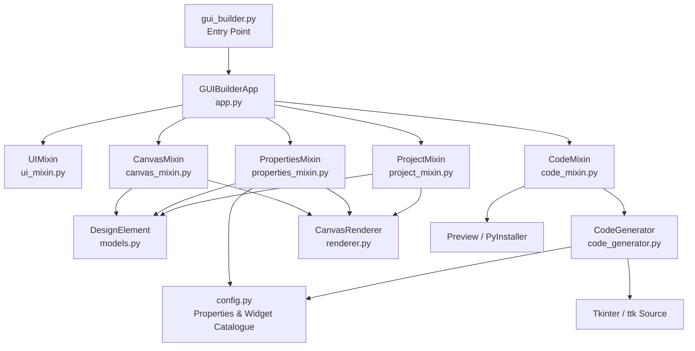
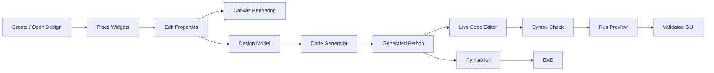
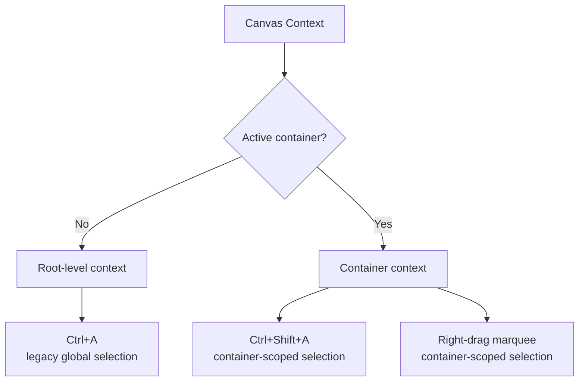
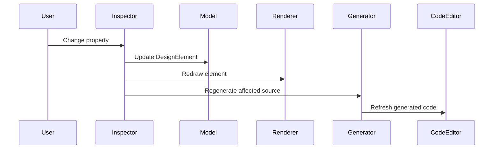

# Tkinter Visual GUI Designer

> A visual drag-and-drop GUI builder for Python/Tkinter applications that lets you design interfaces on a canvas, edit widget properties live, generate runnable Python source, preview the result, and package it as an executable — without hand-writing every geometry call yourself.

[](https://www.python.org/)
[](https://docs.python.org/3/library/tkinter.html)
[](#architecture)
[](#license)

## Overview

**Tkinter Visual GUI Designer** is a desktop visual development environment for building Python GUI applications with Tkinter and ttk.

Instead of starting with a blank Python file and wondering whether `grid()` should happen before or after the third callback, you design the interface visually. The builder stores the design as structured project data, renders it on its canvas, exposes editable properties, and converts the design into Python source code.

The project is deliberately built around a **Single Responsibility Principle (SRP) modular architecture**. The original monolithic application was split into focused modules for canvas interaction, rendering, properties, persistence, code generation, code editing, and application UI while retaining the same application-level `GUIBuilderApp` composition root.

### Elevator pitch

**Design visually → configure properties → generate Python → preview → edit code → build an EXE.**

The builder targets developers who want a faster way to prototype desktop interfaces while still retaining access to the generated Python source rather than being trapped inside a proprietary project format.

---

## Table of Contents

- [Overview](#overview)
- [Feature Highlights](#feature-highlights)
- [Complete Feature List](#complete-feature-list)
- [Supported Widgets](#supported-widgets)
- [Architecture](#architecture)
- [Visual Documentation](#visual-documentation)
- [Installation and Setup](#installation-and-setup)
- [Running the Application](#running-the-application)
- [Basic Workflow](#basic-workflow)
- [Usage Examples](#usage-examples)
- [Project Files and Persistence](#project-files-and-persistence)
- [Code Generation](#code-generation)
- [Live Code Editing](#live-code-editing)
- [Preview and EXE Conversion](#preview-and-exe-conversion)
- [Selection and Container Workflow](#selection-and-container-workflow)
- [Property Inspector](#property-inspector)
- [Recent Reliability Fixes](#recent-reliability-fixes)
- [Architecture Details](#architecture-details)
- [Troubleshooting](#troubleshooting)
- [Performance and Design Notes](#performance-and-design-notes)
- [Contributing](#contributing)
- [License](#license)
- [Support](#support)

---

## Feature Highlights

| Area | What it provides |
|---|---|
| Visual Designer | Place, select, move, resize, and configure GUI elements on a design canvas. |
| Widget Toolbox | Input, display, container, table, image, and calendar controls. |
| Hierarchical Layout | Containers can own child elements and Notebook tabs can act as design scopes. |
| Property Inspector | Live editing of widget properties, geometry, colors, fonts, values, tabs, and other supported settings. |
| Multi-Selection | Select and manipulate multiple elements together. |
| Scoped Selection | Container-aware `Ctrl+Shift+A` and right-drag marquee selection. |
| Grid / Geometry | Canvas sizing, grid snapping, direct width/height properties, and drag/resize handles. |
| Persistence | Save and load `.tvd` design files. |
| Undo / Redo | Project-state history for safe experimentation. |
| Code Generation | Generate Python source from the current visual design. |
| Live Code | Keep generated source synchronized with the visual design. |
| Code Editor | Edit generated code and element handler code directly. |
| Syntax Checking | AST-based Python syntax validation in the code editor. |
| Preview | Execute the generated application in a temporary environment. |
| EXE Packaging | Build a Windows executable through PyInstaller. |
| Resource Management | Copy selected images into the project's `resources/` directory and preserve relative paths. |
| Table Support | Work with Excel/CSV-oriented table widgets. |
| Calendar Support | Calendar widget support through `tkcalendar`. |
| Tooltips | Widget tooltip support in generated applications. |
| SRP Architecture | Focused modules that make future maintenance less hazardous than one giant Python file. |

---

## Complete Feature List

### 1. Visual Design Canvas

- Visual canvas for assembling a desktop GUI.
- Grid-based design surface.
- Element placement using toolbox selection and canvas interaction.
- Element hit-testing.
- Element dragging and repositioning.
- Element resizing through canvas resize handles.
- Geometry synchronization between the canvas and property inspector.
- Canvas width, height, and background configuration.
- Automatic canvas redraw after state changes.
- Visibility-aware rendering.
- Element layering / ordering management.
- Status-bar feedback for design operations.

### 2. Widget Toolbox

The builder currently includes the following design elements:

- Label
- Entry
- Button
- Radiobutton
- Checkbutton
- Scale / Slider
- Combobox
- Spinbox
- Listbox
- Multiline Text
- Canvas
- Progressbar
- Scrollbar
- Frame
- LabelFrame
- Notebook with tabs
- PanedWindow
- Separator
- Table / Treeview
- Image
- Calendar

The internal widget catalogue maps each visual element to a real Tkinter or ttk widget class used by the code generator.

### 3. Containers and Hierarchy

Container-aware design is a core part of the project.

Supported containers include:

- `Frame`
- `LabelFrame`
- `PanedWindow`
- `Notebook`

The project model stores parent relationships so nested controls can be rendered, selected, moved, serialized, and regenerated into the appropriate widget hierarchy.

Notebook designs additionally support:

- Multiple tab names.
- Adding tabs.
- Removing tabs.
- Active-tab selection.
- Child elements placed within Notebook tab containers.

### 4. Element Selection

Selection supports both individual and multi-element workflows.

- Single-click element selection.
- Multi-selection with modifier keys.
- Legacy root-level `Ctrl+A` behavior.
- Container-scoped `Ctrl+Shift+A`.
- Right-button drag marquee selection.
- Scoped marquee selection based on the active container context.
- Selection highlighting.
- Multi-element property panel support.
- Protection of native text-widget `Ctrl+A`, copy, and paste behavior in text-entry controls and the code editor.

The result is a small but important distinction: **“select everything” and “select everything in this container” are no longer the same operation.** Your nested frame no longer gets dragged into a selection brawl with the rest of the application.

### 5. Movement and Geometry

- Drag elements around the canvas.
- Move multiple selected elements as a group.
- Group movement constrained to the canvas bounds.
- Arrow-key style geometry operations where supported by the existing application workflow.
- Resize elements with handles.
- Width and height reflected in the property inspector.
- Grid snapping support.
- Parent-aware movement rules.
- Notebook-aware positioning.

### 6. Property Inspector

Properties are edited from the right-side/property-panel workflow and are applied live where supported.

Examples include:

- Text content.
- Fonts.
- Foreground/background colors.
- Alignment / justification.
- Width and height.
- Orientation.
- Numeric ranges such as Scale and Spinbox values.
- Default values.
- Combobox state.
- Listbox selection mode.
- Sorting flags where supported.
- Notebook tabs and active tab.
- Image source and scaling options.
- Calendar configuration.
- Tooltip text.
- Widget-specific options.
- Parent/container information.

The property system distinguishes between ordinary widget constructor properties and builder-specific properties that require dedicated handling.

### 7. Listbox and Combobox Item Editing

Listbox and Combobox collections no longer rely on a raw string representation such as:

```python
['Item 1', 'Item 2', 'Item 3']
```

Instead, the property inspector provides a dedicated item editor that lets you:

- Select an individual entry.
- Add an entry.
- Remove an entry.
- Preserve the collection as structured element data.
- Feed the resulting collection into generated Python code.

This is considerably nicer than editing a Python list while pretending it is a user interface.

### 8. Border Width Handling

Border width is handled according to the widget toolkit in use.

- Tk widgets use the native Tk border configuration.
- `ttk.Combobox` uses a dedicated ttk style rather than receiving unsupported Tk constructor options.
- `ttk.Notebook` uses dedicated ttk styling rather than an invalid `bd`/`borderwidth` constructor argument.

This prevents unsupported-option crashes while retaining the intended visual property behavior.

### 9. Spinbox Default Values

The Spinbox generator explicitly resets the widget's current value before inserting the configured default value.

This prevents the old behavior where a default such as `5` could effectively become `05` because the widget started with its native `0` and the generated code appended rather than replaced the initial contents.

### 10. Code Generation

The code generator converts the design model into executable Python source using plain Tkinter / ttk.

Capabilities include:

- Automatic imports.
- Widget construction.
- Parent hierarchy reconstruction.
- Geometry placement.
- Property propagation.
- Notebook tab creation.
- Listbox item insertion.
- Combobox value generation.
- Spinbox initialization.
- Table setup.
- Image handling.
- Calendar setup.
- Widget event/handler generation.
- Visibility support.
- Window-state handling.
- Tooltip helper generation.
- Custom module-level code preservation.
- Custom class-level code preservation.
- Element handler-code preservation.

### 11. Live Code Generation

The generated source can be refreshed as the design changes.

The application maintains generated code as part of the design state while protecting custom code regions from accidental regeneration loss.

Relevant workflows include:

- Full regeneration.
- Incremental insertion for newly added elements.
- Code display synchronization.
- Handler-code synchronization.
- Preservation of user-authored custom code.
- Required-import reconciliation.

### 12. Code Editor

The integrated code editor provides:

- Full generated-source editing.
- Per-element handler editing.
- Save action.
- `Ctrl+S` shortcut.
- Syntax validation.
- Error highlighting.
- Line/column reporting.
- Code synchronization back into the visual project where supported.
- Opening the generated code in VS Code.

### 13. Syntax Checking

The code editor uses Python's AST parser to validate syntax.

The workflow identifies:

- Syntax error message.
- Error line.
- Error column.
- The problematic source region.

Saving code containing a syntax error can be intercepted by the editor workflow rather than silently handing broken source to the next stage.

### 14. Project Persistence

Designs can be stored as `.tvd` files.

Persisted project state includes, among other data:

- Elements.
- Element properties.
- IDs and reusable IDs.
- Window title.
- Canvas dimensions.
- Canvas background.
- Window state.
- Imports.
- Generated full code.
- Custom module-level code.
- Custom class-level code.

Loading a project reconstructs the model, canvas, property state, and generated source.

### 15. Undo / Redo

The builder maintains undo and redo stacks using serialized project-state snapshots.

To avoid filling history with every single keystroke while a property is being edited, frequent updates can be debounced before creating the next undo-state snapshot.

### 16. Preview

The **Run Preview** workflow:

1. Generates the current application source.
2. Stages the application in a temporary directory.
3. Copies required resources where applicable.
4. Checks required dependencies.
5. Runs the generated script.
6. Monitors the preview process.
7. Reports runtime failures back to the builder.

### 17. Windows EXE Conversion

The **Convert To EXE** workflow integrates PyInstaller to package the generated application.

The build workflow stages a clean application directory, runs PyInstaller, tracks the build output, and copies the resulting executable to the requested destination.

### 18. Resource and Image Handling

Image-based elements can:

- Select an image file.
- Copy project resources into the builder's `resources/` directory.
- Preserve paths relative to the project/application location.
- Keep aspect ratio where configured.
- Resolve resources without depending on the process's current working directory.

Using a project-root anchor rather than `os.getcwd()` avoids one particularly entertaining class of bugs: a file picker changes the working directory, and suddenly your image disappears because the application has decided the current folder has become part of the data model.

### 19. Tables and Excel/CSV Workflows

The project contains a Table / Treeview element with configuration for external tabular sources.

The dependency list includes `pandas` and `openpyxl`, providing the foundation for Excel/CSV-oriented table workflows.

### 20. Calendar Support

The Calendar element integrates with `tkcalendar`.

Generated applications can use calendar selection events where supported by the project's event mapping.

### 21. Tooltip Support

Generated applications can include a lightweight tooltip helper that displays text when the pointer enters a widget and removes it when the pointer leaves.

### 22. Plain Tkinter / ttk Runtime

The current architecture and generator use **plain Tkinter / ttk** rather than CustomTkinter.

Consequences:

- No `customtkinter` dependency is required.
- Generated applications use standard Python Tk libraries.
- PyInstaller packaging no longer needs a CustomTkinter-specific `--collect-all customtkinter` flag.
- Widget property names are closer to the real Tkinter/ttk API.

---

## Supported Widgets

The current `ELEMENT_TYPES` catalogue contains the following elements:

| Category | Element | Runtime class |
|---|---|---|
| Input | Label | `tk.Label` |
| Input | Entry | `tk.Entry` |
| Input | Button | `tk.Button` |
| Input | Radiobutton | `tk.Radiobutton` |
| Input | Checkbutton | `tk.Checkbutton` |
| Input | Scale | `tk.Scale` |
| Input | Combobox | `ttk.Combobox` |
| Input | Spinbox | `tk.Spinbox` |
| Input | Listbox | `tk.Listbox` |
| Input | Text | `tk.Text` |
| Display | Canvas | `tk.Canvas` |
| Input | Progressbar | `ttk.Progressbar` |
| Display | Scrollbar | `tk.Scrollbar` |
| Containers | Frame | `tk.Frame` |
| Containers | LabelFrame | `tk.LabelFrame` |
| Containers | Notebook | `ttk.Notebook` |
| Containers | PanedWindow | `tk.PanedWindow` |
| Display | Separator | `ttk.Separator` |
| Display | Table | `ttk.Treeview` |
| Display | Image | `tk.Label` |
| Display | Calendar | `Calendar` from `tkcalendar` |

The list is defined in `gui_builder/config.py`, so extending the designer with additional widget types is intended to be a controlled configuration-plus-rendering/code-generation exercise rather than a hunt through one 5,000-line script.

---

## Architecture

The application uses a composition-root-plus-mixins architecture.



### Why the split matters

The application still behaves as one `GUIBuilderApp`, but the responsibilities are separated:

- **`app.py`** — composition root and initialization.
- **`ui_mixin.py`** — application shell, toolbar, toolbox, zoom, scrolling, tooltips, and general UI behavior.
- **`canvas_mixin.py`** — selection, hit testing, placement, moving, resizing, hierarchy, copy/paste, and canvas interaction.
- **`properties_mixin.py`** — property inspector, live property updates, item editors, tab management, and resource selection.
- **`project_mixin.py`** — persistence, project state, undo/redo, new/open/save workflows.
- **`code_mixin.py`** — generated-code lifecycle, preview, EXE conversion, code editor, syntax checking, and custom-code synchronization.
- **`code_generator.py`** — pure responsibility for converting design state into Python source.
- **`renderer.py`** — visual rendering of design elements on the canvas.
- **`models.py`** — `DesignElement` domain model and serialization.
- **`config.py`** — widget catalogue, defaults, property metadata, event mapping, constants, and generation rules.
- **`dependencies.py`** — shared imports and optional dependency detection.

This structure is intentionally pragmatic. It is not a microservice architecture for a button editor. That would be a little ambitious for a desktop GUI designer whose most dangerous dependency is usually a misplaced `grid()` call.

---

## Visual Documentation

### 1. Application Architecture

The Mermaid diagram above shows how the application is assembled and how the major responsibilities interact.

### 2. Design-to-Executable Workflow



### 3. Selection Scope



### 4. Property-to-Code Flow



### Recommended GitHub Screenshots

The repository can be enhanced with screenshots in a future `/docs/images/` directory. Recommended captures are:

1. Main designer window with toolbox, canvas, and property inspector.
2. Nested container showing the scoped-selection workflow.
3. Listbox/Combobox item editor in the property panel.
4. Notebook with multiple editable tabs.
5. Generated-code editor with syntax validation.
6. Previewed generated application.
7. EXE build log and final executable location.

Example Markdown once screenshots are added:

```markdown


```

No screenshots are embedded in this version because the supplied project archive does not contain GUI screenshots. Mermaid diagrams are used instead so this README remains self-contained and GitHub-renderable.

---

## Installation and Setup

### System requirements

Recommended baseline:

- Python **3.10 or newer**.
- A desktop environment capable of running Tkinter.
- Tkinter installed with the Python distribution.
- Windows is recommended for the EXE packaging workflow because the project explicitly supports Windows executable generation through PyInstaller.

### Dependencies

The supplied `requirements.txt` currently contains:

```text
Pillow
pandas
openpyxl
tkcalendar
```

`PyInstaller` is used by the Convert To EXE workflow and can be installed separately or by the application's packaging workflow when needed.

### Step 1 — Clone the repository

```bash
git clone https://github.com/<your-account>/<your-repository>.git
cd <your-repository>
```

### Step 2 — Create a virtual environment

Windows:

```powershell
python -m venv .venv
.venv\Scripts\activate
```

Linux/macOS:

```bash
python3 -m venv .venv
source .venv/bin/activate
```

### Step 3 — Install dependencies

```bash
python -m pip install --upgrade pip
pip install -r requirements.txt
```

For EXE generation, also make sure PyInstaller is available:

```bash
pip install pyinstaller
```

### Step 4 — Verify Tkinter

Run:

```bash
python -c "import tkinter; print(tkinter.TkVersion)"
```

If this fails, the problem is your Python/Tk installation rather than the builder itself.

### Step 5 — Launch the designer

```bash
python gui_builder.py
```

---

## Running the Application

The project's entry point is:

```text
gui_builder.py
```

Its job is intentionally small: create the Tk root window, construct `GUIBuilderApp`, and start Tkinter's main event loop.

```python
import tkinter as tk
from gui_builder.app import GUIBuilderApp

root = tk.Tk()
GUIBuilderApp(root)
root.mainloop()
```

---

## Basic Workflow

A normal design workflow looks like this:

```text
1. Launch GUI Builder
        ↓
2. Choose a widget from the toolbox
        ↓
3. Click the canvas to place it
        ↓
4. Select the widget and edit properties
        ↓
5. Resize / move / nest widgets
        ↓
6. Save the .tvd design
        ↓
7. Inspect generated Python code
        ↓
8. Run Preview
        ↓
9. Correct / extend code if required
        ↓
10. Convert To EXE when the application is ready
```

### Practical example: Create a simple login form

1. Add a `Label` for **Username**.
2. Add an `Entry` below it.
3. Add a `Label` for **Password**.
4. Add another `Entry` and configure `show` to mask input.
5. Add a `Button` with a command/handler.
6. Place all controls inside a `Frame`.
7. Use the property inspector to adjust fonts, colors, dimensions, and text.
8. Open the generated code.
9. Use the editor to implement the real authentication logic.
10. Run Preview.
11. Save the design and package the application when ready.

The visual designer handles the repetitive plumbing; the developer remains responsible for the application logic. That division is healthy. Buttons can be dragged. Business rules should generally not be.

---

## Usage Examples

### Example 1 — Generated Tkinter structure

A generated application follows the normal Python/Tkinter model, conceptually similar to:

```python
import tkinter as tk
from tkinter import ttk


class MainApplication:
    def __init__(self, root):
        self.root = root
        self.root.title("My Application")

        self.label_1 = tk.Label(root, text="Hello")
        self.label_1.place(x=40, y=40, width=120, height=30)

        self.button_1 = tk.Button(root, text="Click Me")
        self.button_1.place(x=40, y=90, width=100, height=34)


if __name__ == "__main__":
    root = tk.Tk()
    MainApplication(root)
    root.mainloop()
```

The exact generated output depends on the widgets and properties in the design.

### Example 2 — Combobox values

A visual design with values:

```text
Development
Testing
Production
```

can result in generated code following the same model as:

```python
combo = ttk.Combobox(
    root,
    values=["Development", "Testing", "Production"],
    state="readonly",
)
```

### Example 3 — Spinbox default

A Spinbox configured with a default value of `5` is generated so the value replaces the widget's native starting contents rather than being appended to them.

Conceptually:

```python
spinbox.delete(0, "end")
spinbox.insert(0, 5)
```

### Example 4 — Custom handler code

An element can carry handler code such as:

```python
messagebox.showinfo("Status", "Button pressed")
```

The code-generation layer keeps handler code associated with the element so a later full regeneration can reproduce the handler instead of silently reverting it to a placeholder.

### Example 5 — Custom application code

The code editor can preserve custom module-level and class-level code that is outside the builder's automatically managed regions.

This enables patterns such as:

```python
import logging


def write_audit_log(message):
    logging.info(message)
```

while continuing to regenerate the visual portion of the application.

---

## Project Files and Persistence

A saved design uses the `.tvd` file extension.

The file stores serialized project state rather than an opaque binary project format.

Conceptual structure:

```json
{
  "elements": [
    {
      "elem_id": 1,
      "elem_type": "Button",
      "props": {
        "text": "Run"
      }
    }
  ],
  "next_id": 2,
  "reusable_ids": [],
  "window_title": "My Application",
  "canvas_w": 800,
  "canvas_h": 600,
  "canvas_bg": "#FAFAFA",
  "window_state": "Normal",
  "canvas_imports": "...",
  "full_code": "...",
  "custom_module_code": "...",
  "custom_class_code": "..."
}
```

The exact serialized content evolves with the project model, so applications should treat `.tvd` as the builder's project format rather than as a public interchange specification.

---

## Code Generation

The central generator is:

```text
gui_builder/code_generator.py
```

The `CodeGenerator` is responsible for turning `DesignElement` records into Python source.

Important generation stages include:

1. Determine the element/widget class.
2. Resolve the parent widget.
3. Convert supported properties to constructor arguments.
4. Handle widget-specific properties separately where Tk/ttk requires it.
5. Generate geometry placement.
6. Generate child hierarchy and Notebook tabs.
7. Apply default values and post-construction initialization.
8. Attach tooltip behavior when configured.
9. Merge event-handler code.
10. Build the final source template.

### Why widget-specific generation exists

Tkinter and ttk do not share one universal constructor API.

For example:

- `tk.Frame` accepts Tk options such as `bd`.
- `ttk.Combobox` does not accept the same constructor options.
- `ttk.Notebook` is also style-driven for many visual properties.
- A Listbox's `items` are data rather than a constructor option that can simply be emitted unchanged.
- A Spinbox default value is often best applied after construction.

The generator therefore uses a generic property path plus targeted special handling where necessary.

---

## Live Code Editing

The code editor is more than a text box glued to the side of the UI.

It maintains the relationship between:

```text
Visual Design
     ↕
Design Model
     ↕
Generated Source
     ↕
Element Handler Code / Custom Code
```

### Important behavior

- Full regeneration rebuilds generated structure from the current model.
- Incremental code updates can insert newly created elements without rewriting everything unnecessarily.
- Handler code is extracted and synchronized.
- Custom module-level code is preserved.
- Custom class-level code is preserved.
- Imports required by the generated source can be reconciled.
- The editor performs syntax validation using Python's AST machinery.

### Syntax-checking example

An invalid edit such as:

```python
if True
    print("missing colon")
```

is detected as a Python syntax error before the normal save flow proceeds.

---

## Preview and EXE Conversion

### Run Preview

The preview workflow creates a temporary staging area so the generated application can be executed independently of the builder's own process.

This is important for catching problems such as:

- Missing imports.
- Missing Python packages.
- Invalid generated syntax.
- Runtime exceptions.
- Missing project resources.

### Convert To EXE

The executable workflow is based on PyInstaller.

Typical process:

```text
Generated Python
      ↓
Dependency detection
      ↓
Clean staging directory
      ↓
Resource copy
      ↓
PyInstaller build
      ↓
Build log
      ↓
Executable
```

The builder can stage resources and handle the generated script so that the final executable is based on the current visual design rather than the builder's own source tree.

### Windows note

For Windows distribution, test the generated EXE on a clean machine before shipping it to users. Your development environment has an inconvenient habit of supplying dependencies that you forgot were dependencies.

---

## Selection and Container Workflow

### Root-level selection

`Ctrl+A` retains the original root-level select-all behavior for compatibility.

### Container-scoped selection

`Ctrl+Shift+A` selects elements inside the active container only.

The active scope is resolved from the current canvas context, and nested containers are traversed through the element parent hierarchy.

### Right-button marquee selection

Right-click and drag creates a selection rectangle scoped to the appropriate container context rather than selecting unrelated objects elsewhere on the canvas.

### Native text controls are protected

Keyboard shortcuts are guarded so text-entry widgets and the code editor can retain their native clipboard and text-selection behavior.

This matters because a GUI builder that steals `Ctrl+A` from an Entry field has technically built a GUI, but not one anyone should have to use.

---

## Property Inspector

The property inspector contains both generic and widget-specific editors.

### Generic property flow

```text
Property metadata
      ↓
Inspector row
      ↓
Tk / ttk control
      ↓
Live change callback
      ↓
DesignElement.props
      ↓
Canvas redraw
      ↓
Code update
```

### Dedicated editors

Some properties cannot be treated as a simple `StringVar` + Entry field.

Dedicated handling exists for:

- Listbox items.
- Combobox values.
- Notebook tabs.
- Notebook active tab.
- Fonts.
- Colors.
- Image files.
- Table source files.
- Window state.
- Canvas dimensions.

---

## Recent Reliability Fixes

This release includes focused fixes for four design-time problems.

### Fix 1 — Container-scoped selection

**Before:** selection commands could operate on unrelated elements outside the current container context.

**After:**

- `Ctrl+Shift+A` selects only elements in the active container.
- Right-drag marquee selection is container-scoped.
- Existing `Ctrl+A` behavior remains available at root scope.

### Fix 2 — Collection editor for Listbox / Combobox

**Before:** item collections were exposed as raw Python-style list strings.

**After:** a dedicated property-panel editor allows individual item selection, addition, and removal.

### Fix 3 — Border width for Label / Frame / Combobox / Notebook

**Before:** some controls rejected the supplied border option or produced an error, especially ttk controls.

**After:**

- Tk-native border handling is used for Tk widgets.
- ttk controls use style configuration where required.
- Notebook no longer receives an invalid constructor option.

### Fix 4 — Spinbox default value

**Before:** the native initial value could remain in the widget and be concatenated with the configured default.

**After:** generated initialization explicitly clears the starting value before inserting the configured value.

---

## Architecture Details

### `models.py`

Defines the `DesignElement` data model.

Responsibilities include:

- Element identity.
- Position and size.
- Parent relationship.
- Selection metadata.
- Property storage.
- Serialization / deserialization.
- Hit-testing helpers.
- Resize-handle calculations.

### `renderer.py`

The `CanvasRenderer` translates design elements into visual canvas representations.

It contains individual drawing paths for many widget classes and visual states.

The renderer is intentionally separate from the data model and code generator.

### `canvas_mixin.py`

Owns interactive editing behavior, including:

- Mouse handling.
- Selection.
- Marquee selection.
- Hierarchy lookup.
- Dragging.
- Resizing.
- Copy/paste.
- Delete.
- Notebook context handling.
- Placement.

### `properties_mixin.py`

Owns the property inspector and live updates.

This is also where the dedicated collection editor lives.

### `project_mixin.py`

Owns:

- New design.
- Save / Save As.
- Load.
- Serialized history.
- Undo.
- Redo.
- Modified-state tracking.

### `code_mixin.py`

Owns the development lifecycle around generated code:

- Generated-code refresh.
- Custom-code preservation.
- Preview execution.
- Dependency checks.
- EXE conversion.
- Code editor.
- Syntax checking.
- VS Code integration.

### `code_generator.py`

Owns Python source generation and widget-specific generation logic.

### `config.py`

Acts as a configuration hub for:

- Widget catalogue.
- Default element properties.
- Toolbox categories.
- Property fields.
- Default event mapping.
- Generation exceptions.
- Constants such as grid size and minimum element dimensions.

---

## Testing and Validation

The project has already been subjected to structural validation during the modular refactor and bug-fix work.

Validated areas include:

- Python syntax compilation for extracted modules.
- Presence of the original application methods across the responsibility mixins.
- Application import/launch path under the documented dependency set.
- Absence of a CustomTkinter runtime dependency.
- Generated-code syntax validation for affected widget classes.
- Mixed-widget generated source validation.
- Container-scope selection logic, including nested containers.
- Preservation of existing left-button canvas interaction behavior.

### Recommended contributor test pass

Before merging significant changes, verify at least:

```text
[ ] Launch application
[ ] Add one widget of each affected type
[ ] Move and resize widgets
[ ] Nest widgets inside Frame / Notebook containers
[ ] Test root Ctrl+A
[ ] Test Ctrl+Shift+A inside a container
[ ] Test right-drag marquee selection
[ ] Edit Combobox / Listbox items
[ ] Test Label / Frame / Combobox / Notebook border width
[ ] Test Spinbox default values: 0, 5, 10, 100
[ ] Save and reopen a .tvd project
[ ] Undo / redo property changes
[ ] Regenerate code
[ ] Run syntax checking
[ ] Run Preview
[ ] Convert a sample project to EXE on Windows
```

---

## Troubleshooting

### `ModuleNotFoundError: No module named 'tkcalendar'`

Install the project requirements:

```bash
pip install -r requirements.txt
```

### Tkinter cannot be imported

Verify that your Python distribution includes Tk support.

On some Linux distributions Tkinter is packaged separately. Install the distribution's Tk package, then repeat the import check.

### Images do not appear

Check:

1. The selected image path still exists.
2. The image format is supported by Pillow/Tk.
3. The image was copied into the project's `resources/` folder where appropriate.
4. The project is being run with a valid resource path.

The project intentionally avoids relying on `os.getcwd()` for resource resolution.

### Combobox or Notebook border width throws an error

Make sure the project is using the current generator implementation. These ttk widgets use style-based handling for border width rather than Tk-only constructor options.

### Spinbox shows `05` instead of `5`

Make sure the generated code contains the post-construction reset behavior:

```python
spinbox.delete(0, "end")
spinbox.insert(0, 5)
```

If you still see concatenation, regenerate the source from the current project before testing an older cached preview file.

### Preview runs in the builder but EXE fails

Check the build log for:

- Missing package detection.
- Hidden imports.
- Missing resources.
- Runtime tracebacks.
- PyInstaller build warnings.

Always test a generated EXE outside the development environment.

### `Ctrl+A` behaves strangely inside an Entry/Text widget

This is intentional. The builder protects native text editing behavior so `Ctrl+A`, clipboard operations, and code-editor interactions are not hijacked by canvas selection logic.

### The property panel appears stale while resizing

Geometry fields are updated during active resize operations without rebuilding the complete inspector. This keeps the UI responsive and prevents a resize gesture from turning into a property-panel demolition derby.

---

## Performance and Design Notes

### Debounced project-state snapshots

Frequent property changes can generate many intermediate states. The project mixin debounces state saving to reduce unnecessary undo-history churn.

### Incremental and full code paths

The code system supports both incremental updates and full regeneration. This is important because not every small visual change needs a complete source rebuild, while major structural operations must have a reliable regeneration path.

### Resource paths are project-relative

The application uses a stable base-directory strategy so file-dialog side effects do not unexpectedly change where assets are resolved from.

### Plain Tkinter / ttk

The decision to move away from CustomTkinter reduces the runtime dependency surface and makes generated code easier to understand for developers already familiar with standard Python GUI programming.

---

## Contributing

Contributions are welcome, especially when they improve reliability without quietly changing established behavior.

### Recommended workflow

1. Fork the repository.
2. Create a feature branch.
3. Make the smallest coherent change that solves the problem.
4. Preserve existing public/internal behavior unless the change explicitly intends to modify it.
5. Add or update tests/checks where practical.
6. Run the application and exercise the affected GUI workflow manually.
7. Validate generated source with Python syntax checking.
8. Document user-visible changes.
9. Submit a pull request describing the problem, solution, regression considerations, and validation performed.

### Architectural rule of thumb

Before adding logic to `GUIBuilderApp`, ask:

> **Which responsibility does this actually belong to?**

If the answer is “canvas interaction”, it probably belongs in `canvas_mixin.py`. If the answer is “code generation”, `code_generator.py` is likely the better home. If the answer is “everywhere”, stop and reconsider — that is how utility functions become ancient ruins.

### Pull request checklist

```text
[ ] Existing feature behavior was preserved
[ ] New behavior is documented
[ ] Affected module remains within its responsibility boundary
[ ] Generated source remains valid Python
[ ] Save/load still works
[ ] Undo/redo still works
[ ] Preview still works
[ ] EXE workflow was considered
[ ] No unnecessary dependency was introduced
[ ] README was updated when user-facing behavior changed
```

---

## License

**License: TBD**

No explicit license file was present in the supplied project archive. Before publishing this repository publicly, add the intended license as `LICENSE` (for example, MIT, Apache-2.0, or another license appropriate to the project and its dependencies).

> Do not publish a repository containing third-party code or assets under a license you do not have permission to grant.

---

## Support

For project-specific support, open a GitHub Issue and include:

- Operating system.
- Python version.
- Installed dependency versions.
- Exact reproduction steps.
- Error message / traceback.
- A minimal `.tvd` project when the issue is design-specific.
- Generated Python source when the issue appears during preview or EXE creation.

A useful bug report is much easier to fix than “it broke somehow after I clicked the orange thing.”

### Suggested issue template

```text
## Environment
OS:
Python:
Project version/commit:

## Problem
Describe the expected behavior and actual behavior.

## Reproduction
1.
2.
3.

## Error
Paste the complete traceback or build log.

## Attachments
- .tvd design, if relevant
- generated .py source, if relevant
- screenshots, if relevant
```

---

## Roadmap Ideas

These are suggestions rather than committed project requirements:

- Automated GUI regression tests.
- Native screenshot gallery in the repository.
- More layout managers and geometry editors.
- Expanded ttk styling controls.
- Additional widget plugins.
- A formal project-file schema/version migration system.
- Better automated EXE smoke tests.
- Configurable themes for the builder UI.
- More advanced code formatting and linting.
- Component templates / reusable design fragments.

---

## Project Status

This repository represents an actively evolved Tkinter visual GUI builder with an SRP-oriented modular architecture and a live code-generation workflow.

The supplied project includes the post-refactor codebase and the recent fixes for:

- Container-scoped selection.
- Listbox / Combobox collection editing.
- Border width handling for affected Tk/ttk widgets.
- Spinbox default-value initialization.

The architecture is intentionally designed so future feature work can be added to the appropriate responsibility module without reopening the original monolithic-code problem.

---

## Credits / Technology Stack

Core technologies:

- **Python** — application language.
- **Tkinter / ttk** — desktop GUI and generated applications.
- **Pillow** — image handling.
- **pandas** — tabular data workflows.
- **openpyxl** — Excel workbook support.
- **tkcalendar** — calendar widget integration.
- **PyInstaller** — Windows executable packaging.

---

## Final Notes

The central design philosophy is straightforward:

> **The GUI builder should make GUI work easier, while the generated Python should remain understandable and editable.**

It is not trying to replace Python. It is trying to remove the repetitive parts of writing Python desktop interfaces so developers can spend more time on behavior, architecture, and user experience — and slightly less time calculating whether a button should be 98 or 100 pixels wide.
"# GuiBuilder" 
