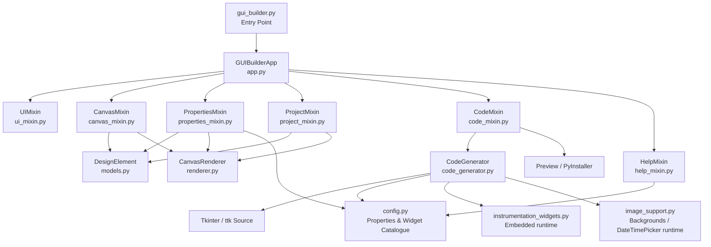
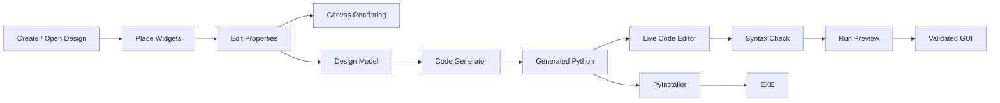
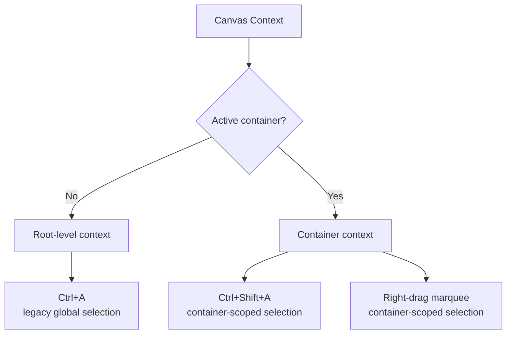
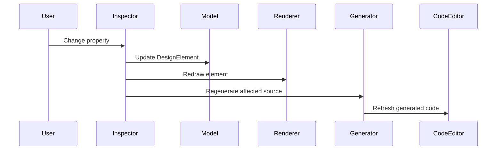
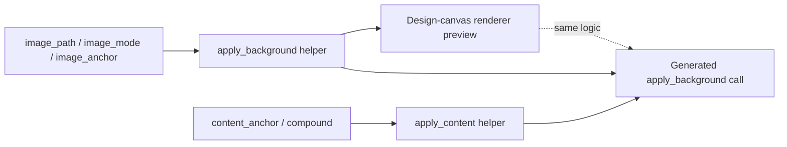

# Tkinter Visual GUI Designer

> A visual drag-and-drop GUI builder for Python/Tkinter applications that lets you design interfaces on a canvas, edit widget properties live, generate runnable Python source, preview the result, and package it as an executable — without hand-writing every geometry call yourself.

[](https://www.python.org/)
[](https://docs.python.org/3/library/tkinter.html)
[](#architecture)
[](#supported-widgets)
[](LICENSE)

## Overview

**Tkinter Visual Designer** is a desktop visual development environment for building Python GUI applications with Tkinter and ttk.

GuiBuilder is **free for both personal and commercial use** under the MIT License — see [License](#license) below.

Instead of starting with a blank Python file and wondering whether `grid()` should happen before or after the third callback, you design the interface visually. The builder stores the design as structured project data, renders it on its own canvas, exposes editable properties for every element, and converts the design into clean, dependency-light Python source code that you can read, edit, preview, and ship.

The project is deliberately built around a **Single Responsibility Principle (SRP) modular architecture**. The original monolithic application was split into focused modules for canvas interaction, rendering, properties, persistence, code generation, code editing, and application UI, while retaining the same application-level `GUIBuilderApp` composition root that the interface has always been built around.

This revision of the project additionally documents and formalizes a set of features that had accumulated since the SRP refactor: a dedicated **DateTimePicker** widget, a universal **background-image and content-alignment system** that works on *any* element (not just the dedicated Image widget), canvas-level background images, a **Window State / Window Lock** system, a **Light/Dark theme switcher**, a **compact toolbox** layout, **design-time grouping and a right-click context menu**, and a full family of **instrumentation/dashboard widgets** (push buttons, LEDs, gauges, and measurement displays) whose runtime is embedded directly into generated applications.

### Elevator pitch

**Design visually → configure properties → generate Python → preview → edit code → build an EXE.**

The builder targets developers who want a faster way to prototype desktop interfaces while still retaining access to the generated Python source, rather than being trapped inside a proprietary project format.

---

## Table of Contents

- [Overview](#overview)
- [Feature Highlights](#feature-highlights)
- [What's New](#whats-new)
- [Complete Feature List](#complete-feature-list)
- [Supported Widgets](#supported-widgets)
- [Backgrounds, Images, and Content Alignment](#backgrounds-images-and-content-alignment)
- [Canvas Settings, Window State, and Window Lock](#canvas-settings-window-state-and-window-lock)
- [Instrumentation & Control-Panel Widgets](#instrumentation--control-panel-widgets)
- [Date and Time Input](#date-and-time-input)
- [Themes and Toolbox Layout](#themes-and-toolbox-layout)
- [Grouping and the Canvas Context Menu](#grouping-and-the-canvas-context-menu)
- [Architecture](#architecture)
- [Visual Documentation](#visual-documentation)
- [Installation and Setup](#installation-and-setup)
- [Running the Application](#running-the-application)
- [Basic Workflow](#basic-workflow)
- [Usage Examples](#usage-examples)
- [Project Files and Persistence](#project-files-and-persistence)
- [Code Generation](#code-generation)
- [Live Code Editing](#live-code-editing)
- [Preview and EXE Conversion](#preview-and-exe-conversion)
- [Selection and Container Workflow](#selection-and-container-workflow)
- [Property Inspector](#property-inspector)
- [Help System and Context Help](#help-system-and-context-help)
- [Keyboard Shortcuts](#keyboard-shortcuts)
- [Recent Reliability Fixes](#recent-reliability-fixes)
- [Architecture Details](#architecture-details)
- [Testing and Validation](#testing-and-validation)
- [Troubleshooting](#troubleshooting)
- [Performance and Design Notes](#performance-and-design-notes)
- [Contributing](#contributing)
- [License](#license)
- [Support](#support)
- [Roadmap Ideas](#roadmap-ideas)
- [Project Status](#project-status)
- [Credits / Technology Stack](#credits--technology-stack)
- [Final Notes](#final-notes)

---

## Feature Highlights

| Area | What it provides |
|---|---|
| Visual Designer | Place, select, move, resize, and configure GUI elements on a design canvas. |
| Widget Toolbox | 27 input, instrumentation, container, display, table, image, and date/time controls. |
| Hierarchical Layout | Containers can own child elements and Notebook tabs can act as design scopes. |
| Property Inspector | Live editing of widget properties, geometry, colors, fonts, values, tabs, backgrounds, and other supported settings. |
| Universal Backgrounds | Any element — and the canvas/window itself — can carry its own positioned/scaled background image. |
| Multi-Selection & Grouping | Select and manipulate multiple elements together, or assign a persistent design-time Group ID. |
| Scoped Selection | Container-aware `Ctrl+Shift+A` and right-drag marquee selection. |
| Right-Click Context Menu | Copy, paste, delete, group/ungroup, reorder, and widget-specific quick actions. |
| Grid / Geometry | Canvas sizing, grid snapping, direct width/height properties, and drag/resize handles. |
| Window Control | Configure startup Window State (Normal/Maximized/Minimized/Centered) and lock the window against resizing. |
| Persistence | Save and load `.tvd` design files. |
| Undo / Redo | Debounced project-state history for safe experimentation. |
| Code Generation | Generate dependency-light Python source from the current visual design. |
| Live Code | Keep generated source synchronized with the visual design. |
| Code Editor | Edit generated code and per-element handler code directly, with find/replace and auto-closing brackets. |
| Syntax Checking | AST-based Python syntax validation in the code editor. |
| Preview | Execute the generated application in a temporary, isolated environment. |
| EXE Packaging | Build a Windows executable through PyInstaller. |
| Resource Management | Copy selected images into the project's `resources/` directory and preserve relative paths. |
| Table Support | Work with Excel/CSV-oriented table widgets. |
| Date & Time Input | Full month-view Calendar plus a compact pop-up DateTimePicker with Date/Time/Custom formats. |
| Instrumentation Widgets | Push buttons, LEDs, gauges, and measurement displays for dashboards and control panels. |
| Tooltips | Widget tooltip support in generated applications. |
| Theming | Light and Dark builder themes, switchable at any time. |
| SRP Architecture | Focused modules that make future maintenance less hazardous than one giant Python file. |

---

## What's New

This section calls out the additions layered on top of the original SRP refactor and instrumentation-widget release. If you already know the builder, this is the fastest way to see what changed.

| Addition | Summary |
|---|---|
| **DateTimePicker widget** | A new Input-category toolbox element: a compact entry field with a pop-up calendar for picking a date, a time, or both. See [Date and Time Input](#date-and-time-input). |
| **Universal background-image system** | `image_path`, `image_mode`, and `image_anchor` are now available on *every* element type (Frame, Button, Label, containers, instrumentation widgets — all of them), not only the dedicated Image element. See [Backgrounds, Images, and Content Alignment](#backgrounds-images-and-content-alignment). |
| **Content alignment / compound** | Label, Button, Checkbutton, and Radiobutton expose `content_anchor` (text position within the widget) and `compound` (image-vs-text placement), matching Tkinter's native `anchor`/`compound` options. |
| **Canvas-level background image** | Canvas Settings (shown when nothing is selected) now includes a background image, mode, and alignment for the whole design/generated window, independent of any per-widget background. |
| **Window State & Window Lock** | Canvas Settings exposes a `Window State` control (Normal/Maximized/Minimized/Centered) and a `Locked` toggle that calls `root.resizable(False, False)` in generated and previewed applications. |
| **Light/Dark theming** | A theme selector in the top toolbar switches the entire builder UI, including the code editor, tooltips, and dialogs. |
| **Compact toolbox mode** | The toolbox can switch between a labeled list and a compact icon grid; Context Help works identically in both. |
| **Design-time grouping** | Selected elements can be grouped under a shared `Group ID` so they can be selected and moved together, without adding a real container to the generated application. |
| **Right-click context menu** | Copy, Paste, Delete, Group Selected, Ungroup Selected, Bring to Front, Send to Back, plus widget-specific actions (e.g. editing an LED's value/state or a Gauge's value). |
| **Single-instance Code Editor** | Reopening the Code Editor while it is already open brings the existing window to the front instead of spawning a duplicate. |
| **LED Display digit-slot stability (v6)** | LED Display geometry is derived from configured `Digits` and widget height rather than DPI-dependent measurement, removing layout drift between the in-app preview and externally-run Python. |
| **Measurement Display font cleanup** | A single Font picker now drives label/value/unit/secondary typography; legacy `*_font_size` properties are folded into the font tuple automatically for older projects. |
| **Run Preview geometry pass** | Run Preview creates its window before executing the generated module and performs a geometry/idle redraw pass so Canvas-backed instrumentation widgets keep their exact size and position, including inside containers. |
| **In-app Help Guide & Context Help updated** | The bundled Help Guide (`Help` button) and hover-based Context Help Mode (`?` button) now document every property above, including the new widgets and canvas-level settings. |
| **Context Help for Properties-pane fields** | Context Help Mode now covers the Properties pane (right sidebar) itself: hovering any property's label or its editor control shows what that property does, for single-element properties, multi-selection common properties, and Canvas Settings alike. See [Help System and Context Help](#help-system-and-context-help). |
| **Compact toolbox list density (v7)** | List-mode toolbox rows are noticeably tighter — smaller category headers, smaller icon/label text, minimal row padding, left-aligned icon+label — closer to a traditional IDE toolbox than the earlier spaced-out rows. Icon/compact mode is unchanged. |
| **LinkLabel widget** | A new Input-category element styled like a hyperlink (blue, underlined by default, hand cursor). An optional `URL` property opens the link in the system browser on click via a generated `webbrowser.open()` call, alongside the usual generated click-handler stub for custom logic. |
| **Status Bar widget** | A new Display-category element that docks itself to the bottom of the canvas at full width the moment you place it — click anywhere on the canvas and it lands at the bottom edge regardless — and re-docks itself (position *and* width) whenever the canvas is resized, whether that's typed into Canvas Settings or dragged live via the canvas's own resize handle. It intentionally has no background-image properties. |
| **Help Guide: Find + Bookmarks** | The Help Guide now has a Find bar (`Ctrl+F` to focus it, Enter/`F3` for next match, Shift+Enter/Shift+`F3` for previous, case-insensitive, all matches highlighted) and a left-hand Bookmarks tree covering every numbered section, each widget category, and every individual element — one click jumps straight to it, with a brief highlight so the landing spot is obvious. |
| **Smaller, direction-aware resize handles** | The orange element resize handles are slightly smaller (10x10px, down from 12x12px). Hovering one now also swaps the mouse cursor to match its drag direction — diagonal for corners, horizontal/vertical for edges — and the same applies to the canvas's own edge handles when nothing is selected. |

---

## Complete Feature List

### 1. Visual Design Canvas

- Visual canvas for assembling a desktop GUI.
- Grid-based design surface with configurable grid size.
- Element placement using toolbox selection and canvas interaction.
- Element hit-testing.
- Element dragging and repositioning.
- Element resizing through canvas resize handles.
- Geometry synchronization between the canvas and property inspector.
- Canvas width, height, background color, and background image configuration.
- Automatic canvas redraw after state changes.
- Visibility-aware rendering.
- Element layering / ordering management (Bring to Front / Send to Back).
- Ctrl + mouse wheel zoom, with a live zoom-percentage indicator.
- Status-bar feedback for design operations.

### 2. Widget Toolbox

The builder currently includes **29** design elements, organized into four toolbox categories: **Input → Instrumentation → Containers → Display**.

- Label, Entry, Button, Radiobutton, Checkbutton, Scale/Slider, Combobox, Spinbox, Listbox, Multiline Text, Progressbar, DateTimePicker, **LinkLabel** *(Input)*
- Push Button, Radio Option, LED Digit, LED Display, LED Indicator, Gauge / Meter, Measurement Display *(Instrumentation)*
- Frame, LabelFrame, Notebook, PanedWindow *(Containers)*
- Canvas, Scrollbar, Separator, Table, Image, Calendar, **Status Bar** *(Display)*

The internal widget catalogue (`ELEMENT_TYPES` in `gui_builder/config.py`) maps each visual element to a real Tkinter/ttk widget class, or to a self-contained custom widget class, that the code generator instantiates.

### 3. Containers and Hierarchy

Container-aware design is a core part of the project.

Supported containers include:

- `Frame`
- `LabelFrame`
- `PanedWindow`
- `Notebook`

The project model stores parent relationships so nested controls can be rendered, selected, moved, serialized, and regenerated into the appropriate widget hierarchy.

Notebook designs additionally support:

- Multiple tab names.
- Adding tabs.
- Removing tabs.
- Active-tab selection.
- Child elements placed within Notebook tab containers.

### 4. Element Selection

Selection supports both individual and multi-element workflows.

- Single-click element selection.
- Multi-selection with independent modifier behavior: **Shift-click adds** an element to the current selection, while **Ctrl-click toggles** the clicked element on/off. A plain click keeps the normal single-selection behavior (including persisted group selection).
- Shift/Ctrl also apply to the left-button marquee: Shift adds everything inside the rectangle, while Ctrl toggles the matched elements.
- Alignment snapping while moving: when a selected element/group approaches another element's left edge, horizontal center, right edge, top edge, vertical center, or bottom edge, a temporary guide line appears and the selection snaps to that axis.
- Legacy root-level `Ctrl+A` behavior.
- Container-scoped `Ctrl+Shift+A`.
- Right-button drag marquee selection.
- Scoped marquee selection based on the active container context.
- Selection highlighting.
- Multi-element property panel support.
- Design-time grouping via a shared `Group ID`, editable from the Properties panel or the right-click context menu.
- Protection of native text-widget `Ctrl+A`, copy, and paste behavior in text-entry controls and the code editor.

The result is a small but important distinction: **"select everything" and "select everything in this container" are no longer the same operation.** Your nested frame no longer gets dragged into a selection brawl with the rest of the application.

### 5. Movement and Geometry

- Drag elements around the canvas with cached, low-overhead alignment snapping.
- Move multiple selected elements as a group.
- Group movement constrained to the canvas bounds.
- Arrow-key geometry nudging for the current selection.
- Resize elements with handles.
- Width and height reflected in the property inspector.
- Grid snapping support.
- Parent-aware movement rules.
- Notebook-aware positioning.
- Bring to Front / Send to Back layering from the context menu.

### 6. Property Inspector

Properties are edited from the property panel and are applied live where supported.

Examples include:

- Text content, fonts, foreground/background colors, alignment/justification.
- Width and height, both in canvas pixels and widget-native units where applicable.
- Orientation.
- Numeric ranges such as Scale and Spinbox values.
- Default values.
- Combobox state.
- Listbox selection mode.
- Sorting flags where supported.
- Notebook tabs and active tab.
- **Per-widget background image, image mode, and image alignment (any element type).**
- **Content alignment and image/text compound placement (Label, Button, Checkbutton, Radiobutton).**
- Table source file, sheet, and column filter.
- Calendar and DateTimePicker configuration.
- Instrumentation properties: shape, behavior, brightness, glow, source binding, gauge ranges/angles, measurement typography.
- Tooltip text.
- Visibility.
- Design-time Group ID.
- Widget-specific options.
- Parent/container information.

The property system distinguishes between ordinary widget constructor properties and builder-specific properties that require dedicated handling (see [`SKIPPED_GENERIC_PROPS`](#code-generation)).

### 7. Listbox and Combobox Item Editing

Listbox and Combobox collections no longer rely on a raw string representation such as:

```python
['Item 1', 'Item 2', 'Item 3']
```

Instead, the property inspector provides a dedicated item editor that lets you:

- Select an individual entry.
- Add an entry.
- Remove an entry.
- Preserve the collection as structured element data.
- Feed the resulting collection into generated Python code.

This is considerably nicer than editing a Python list while pretending it is a user interface.

### 8. Border Width Handling

Border width is handled according to the widget toolkit in use.

- Tk widgets use the native Tk border configuration.
- `ttk.Combobox` uses a dedicated ttk style rather than receiving unsupported Tk constructor options.
- `ttk.Notebook` uses dedicated ttk styling rather than an invalid `bd`/`borderwidth` constructor argument.

This prevents unsupported-option crashes while retaining the intended visual property behavior.

### 9. Spinbox Default Values

The Spinbox generator explicitly resets the widget's current value before inserting the configured default value.

This prevents the old behavior where a default such as `5` could effectively become `05` because the widget started with its native `0` and the generated code appended rather than replaced the initial contents.

### 10. Code Generation

The code generator converts the design model into executable Python source using plain Tkinter / ttk.

Capabilities include:

- Automatic imports (including conditional imports such as `from datetime import date` for Calendar/DateTimePicker elements, and the embedded instrumentation/date-time runtime when needed).
- Widget construction.
- Parent hierarchy reconstruction.
- Geometry placement.
- Property propagation.
- Notebook tab creation.
- Listbox item insertion.
- Combobox value generation.
- Spinbox initialization.
- Table setup.
- Image handling, including the universal background-image helper described below.
- Content-anchor / compound helper generation for text+image widgets.
- Calendar and DateTimePicker setup.
- Widget event/handler generation.
- Visibility support.
- Window-state and window-lock handling.
- Tooltip helper generation.
- Custom module-level code preservation.
- Custom class-level code preservation.
- Element handler-code preservation.

### 11. Live Code Generation

The generated source can be refreshed as the design changes.

The application maintains generated code as part of the design state while protecting custom code regions from accidental regeneration loss.

Relevant workflows include:

- Full regeneration.
- Incremental insertion for newly added elements.
- Code display synchronization.
- Handler-code synchronization.
- Preservation of user-authored custom code.
- Required-import reconciliation.

### 12. Code Editor

The integrated code editor provides:

- Full generated-source editing, in a **single-instance window** — reopening it while already open brings the existing editor to the foreground rather than creating a second one.
- Per-element handler editing.
- Save action, with a `Ctrl+S` shortcut.
- Syntax validation (AST-based).
- Error highlighting with line/column reporting.
- Find (`Ctrl+F`) and Replace (`Ctrl+H`), with `F3`/`Shift+F3` for next/previous match.
- Auto-closing brackets and quotes, smart Tab/Shift+Tab indentation, and smart Backspace.
- Code synchronization back into the visual project where supported.
- Opening the generated code in VS Code.

### 13. Syntax Checking

The code editor uses Python's AST parser to validate syntax.

The workflow identifies:

- Syntax error message.
- Error line.
- Error column.
- The problematic source region.

Saving code containing a syntax error can be intercepted by the editor workflow rather than silently handing broken source to the next stage.

### 14. Project Persistence

Designs can be stored as `.tvd` files.

Persisted project state includes, among other data:

- Elements and element properties (including background images, content alignment, and instrumentation-specific fields).
- IDs and reusable IDs.
- Window title.
- Canvas dimensions and canvas background color.
- **Canvas-level background image, image mode, and image alignment.**
- **Window state and window-lock flag.**
- Imports.
- Generated full code.
- Custom module-level code.
- Custom class-level code.

Loading a project reconstructs the model, canvas, property state, and generated source, and applies safe defaults for properties that did not exist when the project was originally saved (for example, older projects default `Locked` to `No` and fold legacy Measurement Display font-size fields into the new font tuple automatically).

### 15. Undo / Redo

The builder maintains undo and redo stacks using serialized project-state snapshots.

To avoid filling history with every single keystroke while a property is being edited, frequent updates are debounced before creating the next undo-state snapshot.

### 16. Preview

The **Run Preview** workflow:

1. Generates the current application source.
2. Stages the application in a temporary directory.
3. Copies required resources where applicable.
4. Checks required dependencies.
5. Creates the preview window up front and sizes it to the design canvas before executing the generated module, then performs a geometry/idle redraw pass — important for Canvas-backed instrumentation widgets and containers.
6. Runs the generated script.
7. Monitors the preview process.
8. Reports runtime failures back to the builder.

### 17. Windows EXE Conversion

The **Convert To EXE** workflow integrates PyInstaller to package the generated application.

The build workflow stages a clean application directory, runs PyInstaller, tracks the build output, and copies the resulting executable to the requested destination.

### 18. Resource and Image Handling

Image-based elements — and any element using the universal background-image system — can:

- Select an image file.
- Copy project resources into the builder's `resources/` directory.
- Preserve paths relative to the project/application location.
- Keep aspect ratio, stretch, fill, tile, or center the image (`image_mode`).
- Position the image within the element's bounds (`image_anchor`), even when it isn't stretched to fill the full bounds.
- Resolve resources without depending on the process's current working directory.

Using a project-root anchor rather than `os.getcwd()` avoids one particularly entertaining class of bugs: a file picker changes the working directory, and suddenly your image disappears because the application has decided the current folder has become part of the data model.

### 19. Tables and Excel/CSV Workflows

The project contains a Table / Treeview element with configuration for external tabular sources.

The dependency list includes `pandas` and `openpyxl`, providing the foundation for Excel/CSV-oriented table workflows.

### 20. Calendar and DateTimePicker Support

- **Calendar** integrates with `tkcalendar` to place a full month-view date picker on the canvas.
- **DateTimePicker** places a compact entry-style field with a pop-up calendar, and can be configured to capture a date, a time, both, or a fully custom format. See [Date and Time Input](#date-and-time-input) for details.

Generated applications can use calendar/date-time selection events where supported by the project's event mapping (`<<CalendarSelected>>` and `<<DateTimeChanged>>`).

### 21. Tooltip Support

Generated applications can include a lightweight tooltip helper that displays text when the pointer enters a widget and removes it when the pointer leaves.

### 22. Plain Tkinter / ttk Runtime

The current architecture and generator use **plain Tkinter / ttk** rather than CustomTkinter.

Consequences:

- No `customtkinter` dependency is required.
- Generated applications use standard Python Tk libraries.
- PyInstaller packaging no longer needs a CustomTkinter-specific `--collect-all customtkinter` flag.
- Widget property names are closer to the real Tkinter/ttk API.

### 23. Universal Backgrounds and Content Alignment

Every element type — not only the dedicated Image widget — exposes `image_path` (labeled **Background Image**), `image_mode`, and `image_anchor` in its Properties panel. See [Backgrounds, Images, and Content Alignment](#backgrounds-images-and-content-alignment) for the full behavior and generated-code shape.

### 24. Canvas-Level Settings: Window State, Window Lock, and Canvas Background

Selecting nothing on the canvas shows **Canvas Settings** in the Properties panel: canvas width/height, canvas background color, a canvas-level background image with its own mode/alignment, a **Window State** selector, and a **Locked** toggle. See [Canvas Settings, Window State, and Window Lock](#canvas-settings-window-state-and-window-lock).

### 25. Instrumentation and Dashboard Widgets

Push Button, Radio Option, LED Digit, LED Display, LED Indicator, Gauge / Meter, and Measurement Display bring dashboard- and control-panel-style controls to the toolbox, with a self-contained runtime embedded into generated applications. See [Instrumentation & Control-Panel Widgets](#instrumentation--control-panel-widgets).

### 26. Design-Time Grouping and the Context Menu

Right-clicking the canvas opens a context menu scoped to the clicked element or the current selection, including Group Selected / Ungroup Selected, Bring to Front / Send to Back, Copy / Paste / Delete, and per-widget quick actions. See [Grouping and the Canvas Context Menu](#grouping-and-the-canvas-context-menu).

### 27. Light / Dark Theming and Compact Toolbox

A theme selector in the toolbar switches between **Light** and **Dark** themes across the entire application — including the toolbox, property panel, canvas chrome, tooltips, code editor, and Help Guide. The toolbox itself can be switched between a labeled list and a compact icon grid via its own toggle. See [Themes and Toolbox Layout](#themes-and-toolbox-layout).

---

## Supported Widgets

The current `ELEMENT_TYPES` catalogue contains the following elements:

| Category | Element | Toolbox label | Runtime class |
|---|---|---|---|
| Input | Label | 🏷️ Label | `tk.Label` |
| Input | Entry | ✍️ Entry | `tk.Entry` |
| Input | Button | 🔘 Button | `tk.Button` |
| Input | Radiobutton | ◉ Radiobutton | `tk.Radiobutton` |
| Input | Checkbutton | ☑ Checkbutton | `tk.Checkbutton` |
| Input | Scale | 🎚️ Scale (Slider) | `tk.Scale` |
| Input | Combobox | 🔽 Combobox | `ttk.Combobox` |
| Input | Spinbox | 🔢 Spinbox | `tk.Spinbox` |
| Input | Listbox | 📋 Listbox | `tk.Listbox` |
| Input | Text | 📝 Text (Multiline) | `tk.Text` |
| Input | Progressbar | ⏳ Progressbar (ttk) | `ttk.Progressbar` |
| Input | **DateTimePicker** | 🗓️ DateTime Picker | `BuilderDateTimePicker` |
| Input | **LinkLabel** | 🔗 LinkLabel | `tk.Label` |
| Instrumentation | Push Button | 🔘 Push Button | `BuilderPushButton` |
| Instrumentation | Radio Option | ◉ Radio Option | `BuilderRadioButton` |
| Instrumentation | LED Digit | 🔢 LED Digit | `BuilderLEDDisplay` |
| Instrumentation | LED Display | 🔢 LED Display | `BuilderLEDDisplay` |
| Instrumentation | LED Indicator | 💡 LED Indicator | `BuilderLEDIndicator` |
| Instrumentation | Gauge / Meter | ⏱️ Gauge / Meter | `BuilderGauge` |
| Instrumentation | Measurement Display | 📟 Measurement Display | `BuilderMeasurementDisplay` |
| Containers | Frame | 🖼️ Frame (Container) | `tk.Frame` |
| Containers | LabelFrame | 🗂️ LabelFrame | `tk.LabelFrame` |
| Containers | Notebook | 📑 Notebook (Tabs) | `ttk.Notebook` |
| Containers | PanedWindow | 🪟 PanedWindow | `tk.PanedWindow` |
| Display | Canvas | 🎨 Canvas (Drawing) | `tk.Canvas` |
| Display | Scrollbar | ↕️ Scrollbar | `tk.Scrollbar` |
| Display | Separator | ➖ Separator | `ttk.Separator` |
| Display | Table | 📊 Table (Excel/CSV) | `ttk.Treeview` |
| Display | Image | 🖼️ Image | `tk.Label` |
| Display | Calendar | 📅 Calendar | `Calendar` from `tkcalendar` |
| Display | **Status Bar** | ▭ Status Bar | `tk.Label` |

The list is defined in `gui_builder/config.py`, so extending the designer with additional widget types is intended to be a controlled configuration-plus-rendering/code-generation exercise rather than a hunt through one 5,000-line script.

---

## Backgrounds, Images, and Content Alignment

Earlier versions of the builder limited image handling to the dedicated **Image** element. The current property system generalizes this so **any element on the canvas** — a Frame, a Button, a LabelFrame, a Gauge, even a Separator — can carry its own positioned background image, and so text-and-image widgets can control exactly how their content sits inside their bounds.

### Per-widget background image

Every element type exposes three properties (added automatically by `config.py` for any element that doesn't already define its own image handling):

| Property | Property-panel label | Values | Behavior |
|---|---|---|---|
| `image_path` | Background Image | file path | The image drawn behind the widget's own content. |
| `image_mode` | Image Mode | `Stretch`, `Fill`, `Fit`, `Center`, `Tile`, `None` | How the image is scaled/tiled to the widget's bounds. |
| `image_anchor` | Image Alignment | `Top-Left`, `Top`, `Top-Right`, `Left`, `Center`, `Right`, `Bottom-Left`, `Bottom`, `Bottom-Right` | Where the image sits when it isn't stretched to fill the widget completely. |

The design-canvas renderer previews the background using the same mode/anchor logic that the generated application uses at runtime, via a shared `apply_background(widget, path, mode, anchor)` helper that is embedded into generated source whenever at least one element (or the canvas itself) uses a background image.

### Content alignment for text/image widgets

`Label`, `Button`, `Checkbutton`, and `Radiobutton` additionally expose:

| Property | Property-panel label | Values | Behavior |
|---|---|---|---|
| `content_anchor` | Content Alignment | `nw`, `n`, `ne`, `w`, `center`, `e`, `sw`, `s`, `se` | Anchors the widget's text (and image, if any) within its bounds — mirrors Tkinter's native `anchor` option. |
| `compound` | Image + Text | `none`, `left`, `right`, `top`, `bottom`, `center` | Places an optional image relative to the widget's text — mirrors Tkinter's native `compound` option. |

When either property is set, the generator emits a companion `apply_content(widget, anchor, compound)` call so the same helper module handles both backgrounds and content placement consistently.

### Canvas-level background

Selecting nothing on the canvas exposes **Canvas Settings** in the Properties panel (see the next section), which includes its own Background Image / Image Mode / Image Alignment trio for the whole design surface and generated application window — independent of, and layered underneath, any per-widget background.

---

## Canvas Settings, Window State, and Window Lock

With no element selected, the Properties panel switches to **Canvas Settings**, covering the design surface and the generated application's top-level window as a whole:

| Setting | Description |
|---|---|
| Canvas Width / Height | The design surface size in pixels, which becomes the generated window's default content size. |
| Canvas Background | Solid background color for the canvas / generated window. |
| Background Image / Image Mode / Image Alignment | An optional image behind the entire window, using the same Stretch/Fill/Fit/Center/Tile/None modes and 9-point alignment as per-widget backgrounds. |
| **Window State** | `Normal`, `Maximized`, `Minimized`, or `Centered` — applied automatically when the generated or previewed application starts. |
| **Locked** | `Yes`/`No`. When `Yes`, the generated and previewed application calls `root.resizable(False, False)`, disabling manual resizing and the native maximize control on supported desktop window managers. |

Older designs that predate the `Locked` property continue to load safely and default to `Locked = No`.

```text
Canvas Settings
      ↓
Window State  → Normal / Maximized / Minimized / Centered
      ↓
Window Lock   → root.resizable(False, False) when enabled
      ↓
Canvas Background Image → apply_background(root, path, mode, anchor)
```

---

## Instrumentation & Control-Panel Widgets

The GUI Builder includes an additive family of reusable instrumentation-style components designed for dashboards, laboratory interfaces, machine panels, test equipment, and engineering UIs.

### Instrumentation toolbox elements

| Element | Purpose | Key properties |
|---|---|---|
| **Push Button** | Mechanical/control-panel button | Text, Shape (Square/Round), Style, Behavior (Momentary/Toggle), Default State, colors, Command |
| **Radio Option** | Grouped selection control (custom rendering) | Text, Variable, Value, Shape, Selected, colors, Command |
| **LED Digit** | Single seven-segment digit | Digit Value, LED Color, Off Segment Color, Brightness, Glow, Segment Width |
| **LED Display** | Multi-digit seven-segment display | Value, Digits, Leading Zeros, colors, Brightness, Glow, Digit Gap (px), Decimal Places |
| **LED Indicator** | Boolean status lamp | State, On/Off Color, Shape, Brightness, Glow, Source Widget, Source Mode |
| **Gauge / Meter** | Analog-style meter | Value, Minimum/Maximum, sweep start/end angles, arc/track/needle colors, tick count, unit, thickness |
| **Measurement Display** | Composite value + unit display | Label, Value, Unit, Modern/LED style, decimal formatting, prefix/suffix, secondary text, per-element fonts/colors |

### LED Indicator bindings

An LED Indicator may optionally reference another control through **Source Widget**. Supported source controls include Push Button, custom Radio Button, legacy Radiobutton, Checkbutton, and Button.

Source modes:

- **Mirror** — the LED follows the source's state/selection.
- **Toggle** — the LED toggles when the source is activated, where a discrete click state is appropriate.
- **Momentary** — the LED is active only during the source's interaction, where supported.

The relationship is stored using the source element's stable ID rather than its visible caption, so renaming a button's text does not break its LED binding.

### LED Display geometry stability (v6)

Multi-digit LED Display widgets keep their physical digit slots fixed to the configured **Digits** property, with per-digit geometry derived from widget height rather than DPI-dependent text measurement. This removes the layout drift that could previously appear between the in-builder preview and an externally-run generated script, and keeps all configured digit slots visible (as blank/off segments) even when **Leading Zeros** is disabled. The decimal point stays attached to the correct digit and renders in the inter-digit gap. **Digit Gap (px)** is exposed directly in Properties (default `12px`) and is honored identically by the design-canvas renderer and the generated runtime widget; projects saved before this property existed continue to use the default safely.

### Measurement Display typography

A single **Font** picker is the source of truth for each text role's family *and* size — Label, Value, Unit, and Secondary Text each have their own font/color pair (`label_font`/`label_color`, `value_font`/`value_color`, `unit_font`/`unit_color`, `secondary_font`/`secondary_text_color`). Tk font sizes are emitted as negative values so pixel sizing stays consistent between the in-app Run Preview and externally executed Python/VS Code applications. Legacy `*_font_size` properties and the older `color`/`secondary_color` keys from earlier project files are still accepted and are folded into the corresponding font tuple automatically, then hidden from the property panel — existing Measurement Display designs keep working without modification.

### Generated applications

The custom widget runtime is embedded directly into generated Python source. Exported applications therefore do not need to import the GUI Builder package just to render the new controls.

The reusable runtime implementation lives in `gui_builder/instrumentation_widgets.py` and is embedded by `CodeGenerator` when at least one instrumentation widget is present.

### Backward compatibility

Existing `Button`, `Radiobutton`, `Checkbutton`, `Text`, `Canvas`, `Scrollbar`, containers, and other existing element types retain their original implementations. Instrumentation element types are additive and are represented separately in saved `.tvd` project data.

---

## Date and Time Input

The toolbox offers two complementary date/time controls:

### Calendar (`tkcalendar`-based)

A full month-view picker placed directly on the canvas. Configurable via:

- **Initial Date** — starting date shown when the application launches.
- **Date Format** — `yyyy-mm-dd`, `mm/dd/yyyy`, `dd/mm/yyyy`, or `dd-mm-yyyy`.
- **Select Mode** — `day` or `none`.
- **First Weekday** — `monday` or `sunday`.
- **Show Week Numbers** — `Yes`/`No`.
- **Min/Max Date** — bounds that constrain navigation and selection.
- Background, foreground, selected-day, and normal-day colors.

Selecting a date fires `<<CalendarSelected>>` in the generated application.

### DateTimePicker (compact, popup-based)

A single-line entry-style field that opens a small calendar popup, backed by the embedded `BuilderDateTimePicker` runtime class. Configurable via:

| Property | Panel label | Values | Purpose |
|---|---|---|---|
| `initial_datetime` | Initial Value | free text | Seeds the field when the app starts. |
| `display_format` | Display Format | `Date`, `Date & Time`, `Time`, `Custom` | Which parts of the value are shown/edited. |
| `custom_format` | Custom Format | strftime-style pattern | Used only when Display Format is `Custom`. |
| `date_pattern` | Calendar Date Format | `yyyy-mm-dd`, `dd/mm/yyyy`, `dd-mm-yyyy`, `mm/dd/yyyy`, `dd.mm.yyyy`, `yyyy/mm/dd` | Format used by the pop-up calendar and date portion of the value. |
| `time_format` | Time Format | `24h`, `12h` | Clock format for the time portion. |
| `font`, `bg`, `fg` | Font / Background / Foreground | — | Standard field typography and coloring. |

Changing the value fires `<<DateTimeChanged>>` in the generated application. The generator adds `from datetime import date` and `from builder_image_support import BuilderDateTimePicker` to generated imports automatically whenever a DateTimePicker (or a Calendar using date bounds) is present, and embeds the `BuilderDateTimePicker` implementation from `gui_builder/image_support.py` so the generated app has no dependency on the builder package itself.

**When to use which:** reach for **Calendar** when the date should always be visible on-screen (e.g. a scheduling dashboard); reach for **DateTimePicker** when you want a compact form field that only opens a calendar on demand, or when you need to capture a time as well as a date.

---

## Themes and Toolbox Layout

### Light / Dark theme switcher

A theme selector combobox sits in the top toolbar, offering **Light** and **Dark**. Switching themes re-colors the entire application in place — toolbar, toolbox, canvas chrome, property panel, tooltips, the Code Editor (including syntax-status and search-highlight colors), and the Help Guide window — without restarting the builder or losing the current design.

### Compact toolbox

The toolbox can be toggled between:

- **List mode** — each element shown with its full label and icon, one per row.
- **Compact mode** — a dense icon grid, useful once you're familiar with the toolbox and want more vertical space for the canvas or property panel.

Context Help Mode (see below) works identically in both layouts.

---

## Grouping and the Canvas Context Menu

Right-clicking the design canvas opens a context menu scoped to the clicked element or the current selection:

- **Copy** / **Paste** / **Delete**
- **Group Selected** — assigns every selected element the same `Group ID`, so they can be selected and moved together from then on. Disabled when the current selection isn't eligible for grouping.
- **Ungroup Selected** — clears the `Group ID` for the selected elements. Disabled unless the current selection is already grouped.
- **Bring to Front** / **Send to Back** — reorders the clicked element's rendering/stacking order.
- Widget-specific quick actions where applicable — for example, editing an LED's value/state directly, editing a Gauge's value, or jumping straight into a container's child-selection context.

**Grouping is a design-time organization feature only.** It does not insert a runtime container into the generated application; it simply lets the designer treat a set of elements as one unit while arranging the canvas. The `Group` property is visible in the Properties panel for both single-element and multi-element selections, so you can always see (and edit) group membership without opening the context menu.

Right-button drag (marquee) selection remains scoped to the active container context, exactly as with the standard selection workflow described in [Selection and Container Workflow](#selection-and-container-workflow).

---

## Architecture

The application uses a composition-root-plus-mixins architecture.



### Why the split matters

The application still behaves as one `GUIBuilderApp`, but the responsibilities are separated:

- **`app.py`** — composition root and initialization, including all keyboard-shortcut bindings.
- **`ui_mixin.py`** — application shell, toolbar, toolbox (list and compact modes), zoom, scrolling, tooltips, theming, and general UI behavior.
- **`canvas_mixin.py`** — selection, hit testing, placement, moving, resizing, hierarchy, grouping, the right-click context menu, copy/paste, and canvas interaction.
- **`properties_mixin.py`** — property inspector, live property updates, item editors, tab management, Canvas Settings (window state/lock/backgrounds), and resource selection.
- **`project_mixin.py`** — persistence, project state, undo/redo, new/open/save workflows.
- **`code_mixin.py`** — generated-code lifecycle, preview, EXE conversion, code editor, syntax checking, and custom-code synchronization.
- **`help_mixin.py`** — the in-app Help Guide window and hover-based Context Help Mode.
- **`code_generator.py`** — pure responsibility for converting design state into Python source.
- **`renderer.py`** — visual rendering of design elements on the canvas.
- **`models.py`** — `DesignElement` domain model and serialization.
- **`config.py`** — widget catalogue, defaults, property metadata, event mapping, constants, themes, and generation rules.
- **`instrumentation_widgets.py`** — the self-contained instrumentation-widget runtime (Push Button, Radio Option, LED family, Gauge, Measurement Display) that is embedded verbatim into generated applications.
- **`image_support.py`** — shared background-image application logic and the `BuilderDateTimePicker` runtime widget, also embedded into generated applications.
- **`dependencies.py`** — shared imports and optional dependency detection.

This structure is intentionally pragmatic. It is not a microservice architecture for a button editor. That would be a little ambitious for a desktop GUI designer whose most dangerous dependency is usually a misplaced `grid()` call.

---

## Visual Documentation

### 1. Application Architecture

The Mermaid diagram above shows how the application is assembled and how the major responsibilities interact.

### 2. Design-to-Executable Workflow



### 3. Selection Scope



### 4. Property-to-Code Flow



### 5. Background / Content Alignment Pipeline



### Recommended GitHub Screenshots

The repository can be enhanced with screenshots in a future `/docs/images/` directory. Recommended captures are:

1. Main designer window with toolbox, canvas, and property inspector (Light and Dark themes).
2. Nested container showing the scoped-selection workflow.
3. Listbox/Combobox item editor in the property panel.
4. Notebook with multiple editable tabs.
5. An element with a background image applied, showing the Image Mode/Alignment property rows.
6. The Instrumentation category: Gauge, LED Display, and Measurement Display on one canvas.
7. DateTimePicker's pop-up calendar in the design canvas or Run Preview.
8. The right-click context menu with Group/Ungroup and layering options.
9. Generated-code editor with syntax validation.
10. Previewed generated application.
11. EXE build log and final executable location.

Example Markdown once screenshots are added:

```markdown


```

No screenshots are embedded in this version because the supplied project archive does not contain GUI screenshots. Mermaid diagrams are used instead so this README remains self-contained and GitHub-renderable.

---

## Installation and Setup

### System requirements

Recommended baseline:

- Python **3.10 or newer**.
- A desktop environment capable of running Tkinter.
- Tkinter installed with the Python distribution.
- Windows is recommended for the EXE packaging workflow because the project explicitly supports Windows executable generation through PyInstaller.

### Dependencies

The supplied `requirements.txt` currently contains:

```text
Pillow
pandas
openpyxl
tkcalendar
```

`PyInstaller` is used by the Convert To EXE workflow and can be installed separately or by the application's packaging workflow when needed.

> **Licensing note:** `tkcalendar` (used by the Calendar and DateTimePicker widgets) is GPL-3.0-licensed. This doesn't affect GuiBuilder's own MIT license, but if you use Convert To EXE on a generated app that includes a Calendar/DateTimePicker, the resulting executable statically bundles GPL-3.0 code and inherits GPL-3.0 distribution obligations. See [`THIRD-PARTY-NOTICES.md`](THIRD-PARTY-NOTICES.md#2-tkcalendar-gpl-30-or-later--read-this-before-shipping-a-exe) before shipping such a build commercially.

### Step 1 — Clone the repository

```bash
git clone https://github.com/<your-account>/<your-repository>.git
cd <your-repository>
```

### Step 2 — Create a virtual environment

Windows:

```powershell
python -m venv .venv
.venv\Scripts\activate
```

Linux/macOS:

```bash
python3 -m venv .venv
source .venv/bin/activate
```

### Step 3 — Install dependencies

```bash
python -m pip install --upgrade pip
pip install -r requirements.txt
```

For EXE generation, also make sure PyInstaller is available:

```bash
pip install pyinstaller
```

### Step 4 — Verify Tkinter

Run:

```bash
python -c "import tkinter; print(tkinter.TkVersion)"
```

If this fails, the problem is your Python/Tk installation rather than the builder itself.

### Step 5 — Launch the designer

```bash
python gui_builder.py
```

---

## Running the Application

The project's entry point is:

```text
gui_builder.py
```

Its job is intentionally small: create the Tk root window, construct `GUIBuilderApp`, and start Tkinter's main event loop.

```python
import tkinter as tk
from gui_builder.app import GUIBuilderApp

root = tk.Tk()
GUIBuilderApp(root)
root.mainloop()
```

---

## Basic Workflow

A normal design workflow looks like this:

```text
1. Launch GUI Builder
        ↓
2. Choose a widget from the toolbox
        ↓
3. Click the canvas to place it
        ↓
4. Select the widget and edit properties (including background/alignment if desired)
        ↓
5. Resize / move / nest / group widgets
        ↓
6. Configure Canvas Settings: size, background, window state, lock
        ↓
7. Save the .tvd design
        ↓
8. Inspect generated Python code
        ↓
9. Run Preview
        ↓
10. Correct / extend code if required
        ↓
11. Convert To EXE when the application is ready
```

### Practical example: Create a simple login form

1. Add a `Label` for **Username**.
2. Add an `Entry` below it.
3. Add a `Label` for **Password**.
4. Add another `Entry` and configure `show` to mask input.
5. Add a `Button` with a command/handler.
6. Place all controls inside a `Frame`, and give the Frame a subtle background image via **Background Image** / **Image Mode: Fit**.
7. Use the property inspector to adjust fonts, colors, dimensions, and text.
8. Group the two label/entry pairs so they can be repositioned together.
9. Open the generated code.
10. Use the editor to implement the real authentication logic.
11. Run Preview.
12. Save the design and package the application when ready.

The visual designer handles the repetitive plumbing; the developer remains responsible for the application logic. That division is healthy. Buttons can be dragged. Business rules should generally not be.

---

## Usage Examples

### Example 1 — Generated Tkinter structure

A generated application follows the normal Python/Tkinter model, conceptually similar to:

```python
import tkinter as tk
from tkinter import ttk


class MainApplication:
    def __init__(self, root):
        self.root = root
        self.root.title("My Application")

        self._elem_1 = tk.Label(root, text="Hello")
        self._elem_1.place(x=40, y=40, width=120, height=30)

        self._elem_2 = tk.Button(root, text="Click Me")
        self._elem_2.place(x=40, y=90, width=100, height=34)


if __name__ == "__main__":
    root = tk.Tk()
    MainApplication(root)
    root.mainloop()
```

The exact generated output depends on the widgets and properties in the design.

### Example 2 — Combobox values

A visual design with values:

```text
Development
Testing
Production
```

can result in generated code following the same model as:

```python
combo = ttk.Combobox(
    root,
    values=["Development", "Testing", "Production"],
    state="readonly",
)
```

### Example 3 — Spinbox default

A Spinbox configured with a default value of `5` is generated so the value replaces the widget's native starting contents rather than being appended to them.

Conceptually:

```python
spinbox.delete(0, "end")
spinbox.insert(0, 5)
```

### Example 4 — Background image on a Frame

A Frame configured with `image_path="banner.png"`, `image_mode="Fit"`, and `image_anchor="Top"` results in generated code conceptually similar to:

```python
self.frame_1 = tk.Frame(root, bg="#F5F5F5")
self.frame_1.place(x=20, y=20, width=400, height=200)
apply_background(self.frame_1, "banner.png", "Fit", "Top")
```

where `apply_background` is the shared helper embedded from `image_support.py`.

### Example 5 — DateTimePicker with a custom format

A DateTimePicker configured with `display_format="Custom"` and `custom_format="%d %b %Y %H:%M"` is generated so the widget's popup calendar and text field agree on the same pattern, conceptually:

```python
self.datetimepicker_1 = BuilderDateTimePicker(
    root, initial_value="", display_format="Custom",
    custom_format="%d %b %Y %H:%M", date_pattern="yyyy-mm-dd",
    time_format="24h",
)
self.datetimepicker_1.place(x=40, y=140, width=250, height=32)
```

### Example 6 — Custom handler code

An element can carry handler code such as:

```python
messagebox.showinfo("Status", "Button pressed")
```

The code-generation layer keeps handler code associated with the element so a later full regeneration can reproduce the handler instead of silently reverting it to a placeholder.

### Example 7 — Custom application code

The code editor can preserve custom module-level and class-level code that is outside the builder's automatically managed regions.

This enables patterns such as:

```python
import logging


def write_audit_log(message):
    logging.info(message)
```

while continuing to regenerate the visual portion of the application.

---

## Project Files and Persistence

A saved design uses the `.tvd` file extension.

The file stores serialized project state rather than an opaque binary project format.

Conceptual structure:

```json
{
  "elements": [
    {
      "elem_id": 1,
      "elem_type": "Button",
      "props": {
        "text": "Run",
        "image_path": "",
        "image_mode": "Fit",
        "image_anchor": "Center",
        "content_anchor": "center",
        "compound": "none"
      }
    }
  ],
  "next_id": 2,
  "reusable_ids": [],
  "window_title": "My Application",
  "canvas_w": 800,
  "canvas_h": 600,
  "canvas_bg": "#FAFAFA",
  "canvas_bg_image": "",
  "canvas_bg_image_mode": "Fit",
  "canvas_bg_image_anchor": "Center",
  "window_state": "Normal",
  "window_locked": false,
  "canvas_imports": "...",
  "full_code": "...",
  "custom_module_code": "...",
  "custom_class_code": "..."
}
```

The exact serialized content evolves with the project model, so applications should treat `.tvd` as the builder's project format rather than as a public interchange specification.

---

## Code Generation

The central generator is:

```text
gui_builder/code_generator.py
```

The `CodeGenerator` is responsible for turning `DesignElement` records into Python source.

Important generation stages include:

1. Determine the element/widget class.
2. Resolve the parent widget.
3. Convert supported properties to constructor arguments.
4. Handle widget-specific properties separately where Tk/ttk requires it.
5. Generate geometry placement.
6. Generate child hierarchy and Notebook tabs.
7. Apply default values and post-construction initialization.
8. Apply background images (`apply_background`) and content alignment (`apply_content`) where configured.
9. Attach tooltip behavior when configured.
10. Merge event-handler code.
11. Reconcile window-state / window-lock and canvas-level background code.
12. Build the final source template.

### Why widget-specific generation exists

Tkinter and ttk do not share one universal constructor API.

For example:

- `tk.Frame` accepts Tk options such as `bd`.
- `ttk.Combobox` does not accept the same constructor options.
- `ttk.Notebook` is also style-driven for many visual properties.
- A Listbox's `items` are data rather than a constructor option that can simply be emitted unchanged.
- A Spinbox default value is often best applied after construction.
- Background images, content alignment, tables, and calendar/date-time widgets are all data-driven post-construction concerns rather than plain constructor keyword arguments.

The generator therefore uses a generic property path plus targeted special handling where necessary; properties handled this way are collected in `SKIPPED_GENERIC_PROPS` in `config.py` so they are never accidentally passed straight through to a widget constructor that doesn't understand them.

---

## Live Code Editing

The code editor is more than a text box glued to the side of the UI.

It maintains the relationship between:

```text
Visual Design
     ↕
Design Model
     ↕
Generated Source
     ↕
Element Handler Code / Custom Code
```

### Important behavior

- Full regeneration rebuilds generated structure from the current model.
- Incremental code updates can insert newly created elements without rewriting everything unnecessarily.
- Handler code is extracted and synchronized.
- Custom module-level code is preserved.
- Custom class-level code is preserved.
- Imports required by the generated source can be reconciled.
- The editor performs syntax validation using Python's AST machinery.
- The editor window is single-instance: reopening it focuses the existing window instead of creating a duplicate.
- Find/Replace, `F3`/`Shift+F3`, and auto-closing brackets/quotes are available while editing.

### Syntax-checking example

An invalid edit such as:

```python
if True
    print("missing colon")
```

is detected as a Python syntax error before the normal save flow proceeds.

---

## Preview and EXE Conversion

### Run Preview

The preview workflow creates a temporary staging area so the generated application can be executed independently of the builder's own process. The preview window is created and sized to the design canvas *before* the generated module runs, and a geometry/idle redraw pass follows — this matters most for Canvas-backed instrumentation widgets, which need accurate final dimensions to render their gauges, LEDs, and needles correctly, including when nested inside containers.

This step is important for catching problems such as:

- Missing imports.
- Missing Python packages.
- Invalid generated syntax.
- Runtime exceptions.
- Missing project resources.

### Convert To EXE

The executable workflow is based on PyInstaller.

Typical process:

```text
Generated Python
      ↓
Dependency detection
      ↓
Clean staging directory
      ↓
Resource copy
      ↓
PyInstaller build
      ↓
Build log
      ↓
Executable
```

The builder can stage resources and handle the generated script so that the final executable is based on the current visual design rather than the builder's own source tree.

### Windows note

For Windows distribution, test the generated EXE on a clean machine before shipping it to users. Your development environment has an inconvenient habit of supplying dependencies that you forgot were dependencies.

---

## Selection and Container Workflow

### Root-level selection

`Ctrl+A` retains the original root-level select-all behavior for compatibility.

### Container-scoped selection

`Ctrl+Shift+A` selects elements inside the active container only.

The active scope is resolved from the current canvas context, and nested containers are traversed through the element parent hierarchy.

### Right-button marquee selection

Right-click and drag creates a selection rectangle scoped to the appropriate container context rather than selecting unrelated objects elsewhere on the canvas. A plain right-click (without dragging) instead opens the [context menu](#grouping-and-the-canvas-context-menu).

### Native text controls are protected

Keyboard shortcuts are guarded so text-entry widgets and the code editor can retain their native clipboard and text-selection behavior.

This matters because a GUI builder that steals `Ctrl+A` from an Entry field has technically built a GUI, but not one anyone should have to use.

---

## Property Inspector

The property inspector contains both generic and widget-specific editors.

### Generic property flow

```text
Property metadata
      ↓
Inspector row
      ↓
Tk / ttk control
      ↓
Live change callback
      ↓
DesignElement.props
      ↓
Canvas redraw
      ↓
Code update
```

### Dedicated editors

Some properties cannot be treated as a simple `StringVar` + Entry field.

Dedicated handling exists for:

- Listbox items.
- Combobox values.
- Notebook tabs.
- Notebook active tab.
- Fonts.
- Colors.
- Image files, including the universal background-image trio (path/mode/anchor) shared by every element.
- Table source files.
- Window state and window lock (Canvas Settings).
- Canvas dimensions and canvas-level background image.
- Group ID (single and multi-selection).
- Instrumentation-specific fields such as gauge angles, LED source bindings, and measurement typography.

---

## Help System and Context Help

The builder ships with a two-layer documentation system, both driven from the same underlying metadata (`ELEMENT_HELP`, `PROPERTY_HELP`, and `TOOLTIP_HELP` in `gui_builder/help_mixin.py`), so the in-app guide never drifts far from the actual widget catalogue.

### The Help Guide (`Help` button)

Clicking **Help** in the top toolbar opens a scrollable guide covering:

1. Main interface — toolbar, toolbox, canvas, property panel, and live code.
2. Contextual hover help — how to enable/disable it.
3. **Every GUI element and every one of its properties**, grouped by toolbox category, generated directly from the live `ELEMENT_TYPES`/`PROPERTY_FIELDS` catalogue so newly added widgets automatically appear.
4. Selection and containers.
5. Code generation and events.
6. Keyboard shortcuts.
7. Practical workflow.
8. The built-in per-widget Tooltip property (and how it differs from Context Help).
9. **Backgrounds and content alignment** — the universal background-image system and content/compound options.
10. **Canvas settings, window state, and lock** — what Canvas Settings controls and what `Locked` does at runtime.
11. **Instrumentation and dashboard widgets** — the Instrumentation category and LED-source bindings.
12. **Grouping and the canvas context menu** — what each context-menu action does.
13. **Date and time input** — when to use Calendar versus DateTimePicker.
14. **Themes and toolbox layout** — the Light/Dark switcher and compact toolbox.

The guide window is single-instance (like the Code Editor): triggering Help again while it's open brings the existing window forward instead of opening a second copy.

### Context Help Mode (`?` button)

Clicking the **?** button toggles **Context Help Mode**. While enabled, hovering over any toolbox item, canvas element, or major interface control (including the theme selector and canvas itself) shows a tooltip describing what it does, sourced from the same `ELEMENT_HELP`/`PROPERTY_HELP`/`TOOLTIP_HELP` tables used by the full guide. This works identically whether the toolbox is in list mode or compact mode, and is automatically disabled while hovering leaves the target widget so it never interferes with normal tooltips shown by the generated application's own widgets.

**Context Help now also covers every field in the Properties pane (right sidebar).** With Context Help Mode enabled, hovering over a property's label *or* its editor control — an Entry, a Combobox, a color swatch/"Pick" button, a font picker, the item-collection editor, or any nested control inside a row — shows the same explanation for that property, pulled from `PROPERTY_HELP`. This applies to:

- Every per-element property row (single-selection).
- The "(All)" common-property rows shown for a multi-element selection (Group, Font, Foreground, Background, Width, Height).
- **Canvas Settings** (shown when nothing is selected): Window Title, Canvas Width/Height, Canvas Background, Background Image/Mode/Alignment, Window State, and Locked.

Because property rows are reused and rebuilt as the selection changes (the same Entry/label widgets are repurposed for a different field from one click to the next), each row's hover text is re-bound every time its contents change, so the tooltip always matches whatever property currently occupies that row — it never shows stale text left over from a previously selected element.

Context Help intentionally does **not** interfere with:

- The Tooltip property (which documents the generated application to its end users, not the builder to its designer).
- Native text-widget interactions such as `Ctrl+A`, copy, and paste inside Entry/Text fields or the code editor.

---

## Keyboard Shortcuts

| Shortcut | Action |
|---|---|
| `Ctrl+N` | New design |
| `Ctrl+O` | Load design |
| `Ctrl+S` | Save design |
| `Ctrl+Shift+S` | Save As |
| `Ctrl+C` / `Ctrl+V` | Copy and paste selected elements |
| `Delete` | Delete selected elements |
| `Ctrl+Z` / `Ctrl+Y` | Undo / redo |
| `Ctrl+A` | Select all elements in the canvas |
| `Ctrl+Shift+A` | Select all elements within the active container |
| Arrow keys | Move selected elements |
| `Ctrl` + mouse wheel | Zoom the design canvas |
| Double-click element | Open its code in the code editor |
| Right-click (no drag) | Open the canvas context menu (Copy/Paste/Delete/Group/Ungroup/Layering) |
| Right-drag | Box-select within the active container scope |

Inside the Code Editor specifically:

| Shortcut | Action |
|---|---|
| `Ctrl+S` | Save code (runs syntax check first) |
| `Ctrl+F` | Focus the Find field |
| `Ctrl+H` | Focus the Replace field |
| `F3` / `Shift+F3` | Find next / previous match |
| `Tab` / `Shift+Tab` | Indent / outdent |
| `Escape` | Clear search highlighting and return focus to the editor |

---

## Recent Reliability Fixes

This release includes focused fixes across several design-time and generated-code problems, layered on top of the original SRP refactor.

### Fix 1 — Container-scoped selection

**Before:** selection commands could operate on unrelated elements outside the current container context.

**After:**

- `Ctrl+Shift+A` selects only elements in the active container.
- Right-drag marquee selection is container-scoped.
- Existing `Ctrl+A` behavior remains available at root scope.

### Fix 2 — Collection editor for Listbox / Combobox

**Before:** item collections were exposed as raw Python-style list strings.

**After:** a dedicated property-panel editor allows individual item selection, addition, and removal.

### Fix 3 — Border width for Label / Frame / Combobox / Notebook

**Before:** some controls rejected the supplied border option or produced an error, especially ttk controls.

**After:**

- Tk-native border handling is used for Tk widgets.
- ttk controls use style configuration where required.
- Notebook no longer receives an invalid constructor option.

### Fix 4 — Spinbox default value

**Before:** the native initial value could remain in the widget and be concatenated with the configured default.

**After:** generated initialization explicitly clears the starting value before inserting the configured value.

### Fix 5 — LED Display external layout instability (v6)

**Before:** LED Display digit geometry could compress or drift differently between the design-time preview and an externally executed Python/VS Code run, especially at different DPI settings, and disabling Leading Zeros could visually collapse unused digit slots.

**After:** physical digit slots are fixed by the configured `Digits` property, geometry is derived from widget height rather than measured text, all configured slots stay visible as blank/off positions when Leading Zeros is off, numeric content stays right-aligned, and the decimal point stays attached to the correct digit within the inter-digit gap.

### Fix 6 — Measurement Display typography and initialization order

**Before:** separate Label/Value/Unit/Secondary "Font Size" rows could drift out of sync with the Font picker, sizes were not consistently interpreted as pixels across Run Preview versus external execution, and a Code Editor initialization-order issue could surface intermittently.

**After:** a single Font picker per text role is the source of truth for family and size; Tk font sizes are emitted as negative values for consistent pixel interpretation; legacy `*_font_size` and `color`/`secondary_color` values are folded into the new font/color pairs automatically for old projects; and the Code Editor now publishes its Text widget reference only after the widget is created and populated.

### Fix 7 — Run Preview geometry for Canvas-backed widgets

**Before:** instrumentation widgets could occasionally render at an incorrect size in Run Preview before the window had fully settled, especially when nested in containers.

**After:** Run Preview creates its window and applies the design canvas size before executing the generated module, then performs an explicit geometry/idle redraw pass so Canvas-backed controls retain their intended size and position.

### Fix 8 — Universal backgrounds instead of Image-only

**Before:** background imagery was only available through the dedicated Image element; other widgets had no supported way to carry a background image, and text/image alignment on Label/Button/Checkbutton/Radiobutton was not independently configurable.

**After:** every element exposes `image_path`/`image_mode`/`image_anchor`, the canvas/window itself carries its own independent background trio, and Label/Button/Checkbutton/Radiobutton expose `content_anchor`/`compound` for fine-grained text and image placement — all rendered consistently by shared `apply_background`/`apply_content` helpers in both the design-canvas preview and the generated application.

---

## Architecture Details

### `models.py`

Defines the `DesignElement` data model.

Responsibilities include:

- Element identity.
- Position and size.
- Parent relationship.
- Selection and grouping metadata.
- Property storage.
- Serialization / deserialization.
- Hit-testing helpers.
- Resize-handle calculations.

### `renderer.py`

The `CanvasRenderer` translates design elements into visual canvas representations.

It contains individual drawing paths for many widget classes and visual states, including background-image preview rendering (shared logic with the generated `apply_background` helper) and dedicated draw routines for DateTimePicker and every instrumentation widget.

The renderer is intentionally separate from the data model and code generator.

### `canvas_mixin.py`

Owns interactive editing behavior, including:

- Mouse handling.
- Selection.
- Marquee selection.
- Hierarchy lookup.
- Dragging.
- Resizing.
- Copy/paste.
- Delete.
- Grouping/ungrouping and the right-click context menu.
- Notebook context handling.
- Placement.

### `properties_mixin.py`

Owns the property inspector and live updates.

This is also where the dedicated collection editor, the universal background-image controls, and Canvas Settings (size/background/window state/lock) live.

### `project_mixin.py`

Owns:

- New design.
- Save / Save As.
- Load.
- Serialized history.
- Undo.
- Redo.
- Modified-state tracking.
- Backward-compatible defaulting of newer properties (e.g. `WINDOW_LOCKED`, `CANVAS_BG_IMAGE*`) for older `.tvd` files.

### `code_mixin.py`

Owns the development lifecycle around generated code:

- Generated-code refresh.
- Custom-code preservation.
- Preview execution (including the geometry/idle redraw pass).
- Dependency checks.
- EXE conversion.
- Code editor (single-instance window, find/replace, auto-closing brackets).
- Syntax checking.
- VS Code integration.

### `code_generator.py`

Owns Python source generation and widget-specific generation logic, including the `apply_background`/`apply_content` helper emission and window-state/window-lock code.

### `help_mixin.py`

Owns the in-app Help Guide window and hover-based Context Help Mode, driven from `ELEMENT_HELP`, `PROPERTY_HELP`, and `TOOLTIP_HELP`.

### `instrumentation_widgets.py`

Owns the embeddable runtime classes for Push Button, Radio Option, the LED family, Gauge, and Measurement Display.

### `image_support.py`

Owns the shared background-image application logic and the `BuilderDateTimePicker` runtime widget, both embedded verbatim into generated applications.

### `config.py`

Acts as a configuration hub for:

- Widget catalogue (`ELEMENT_TYPES`).
- Default element properties.
- Toolbox categories.
- Property fields (`PROPERTY_FIELDS`), including the automatic per-element injection of `canvas_w`/`canvas_h`/`tooltip`/`visible`/background-image/content-alignment fields.
- Default event mapping (`DEFAULT_EVENT_MAP`).
- Generation exceptions (`SKIPPED_GENERIC_PROPS`).
- Light/Dark theme definitions (`THEMES`).
- Constants such as grid size and minimum element dimensions.

---

## Testing and Validation

The project has already been subjected to structural validation during the modular refactor and subsequent feature/bug-fix work.

Validated areas include:

- Python syntax compilation for every module (`py_compile`).
- Presence of the original application methods across the responsibility mixins.
- Application import/launch path under the documented dependency set.
- Absence of a CustomTkinter runtime dependency.
- Generated-code syntax validation for affected widget classes, including DateTimePicker and every instrumentation widget.
- Mixed-widget generated source validation.
- Container-scope selection logic, including nested containers.
- Preservation of existing left-button canvas interaction behavior.
- LED Display geometry with multiple configured digit counts and decimal values.
- Code Editor lifecycle (open, populate, save, close) as a single-instance window.
- Background-image and content-alignment code paths for both per-widget and canvas-level configurations.

### Recommended contributor test pass

Before merging significant changes, verify at least:

```text
[ ] Launch application
[ ] Add one widget of each affected type, including DateTimePicker and every Instrumentation widget
[ ] Move and resize widgets
[ ] Nest widgets inside Frame / Notebook containers
[ ] Test root Ctrl+A
[ ] Test Ctrl+Shift+A inside a container
[ ] Test right-drag marquee selection
[ ] Test right-click context menu: Copy/Paste/Delete/Group/Ungroup/Bring to Front/Send to Back
[ ] Edit Combobox / Listbox items
[ ] Test Label / Frame / Combobox / Notebook border width
[ ] Test Spinbox default values: 0, 5, 10, 100
[ ] Apply a background image + each Image Mode/Alignment combination to a non-Image element
[ ] Apply Content Alignment / Image + Text (compound) to a Button
[ ] Configure Canvas Settings: background image, Window State, Locked
[ ] Configure a DateTimePicker in Date, Time, Date & Time, and Custom modes
[ ] Bind an LED Indicator to a Push Button / Radio Option / Checkbutton source
[ ] Group and ungroup a multi-element selection
[ ] Switch between Light and Dark themes
[ ] Toggle compact toolbox mode
[ ] Save and reopen a .tvd project (including an older project without newer properties)
[ ] Undo / redo property changes
[ ] Regenerate code
[ ] Run syntax checking
[ ] Reopen the Code Editor twice and confirm it does not duplicate
[ ] Run Preview, including at least one Canvas-backed instrumentation widget inside a container
[ ] Convert a sample project to EXE on Windows
```

---

## Troubleshooting

### `ModuleNotFoundError: No module named 'tkcalendar'`

Install the project requirements:

```bash
pip install -r requirements.txt
```

### Tkinter cannot be imported

Verify that your Python distribution includes Tk support.

On some Linux distributions Tkinter is packaged separately. Install the distribution's Tk package, then repeat the import check.

### Images do not appear

Check:

1. The selected image path still exists.
2. The image format is supported by Pillow/Tk.
3. The image was copied into the project's `resources/` folder where appropriate.
4. The project is being run with a valid resource path.
5. If the image is being used as a background on a non-Image element, confirm `Image Mode` isn't set to `None`.

The project intentionally avoids relying on `os.getcwd()` for resource resolution.

### A background image looks cropped, tiny, or off-center

Check the element's (or Canvas Settings') **Image Mode**:

- `Stretch`/`Fill` will distort or crop non-matching aspect ratios by design.
- `Fit` preserves aspect ratio inside the bounds — use this for most cases.
- `Center`/`Tile` do not scale the source image at all, so a very large or very small source image may look wrong at those settings; resize the source asset instead.

Then check **Image Alignment** — a `Fit`-mode image that appears anchored to one side is usually working as configured; switch alignment to `Center` if that's not the intent.

### Combobox or Notebook border width throws an error

Make sure the project is using the current generator implementation. These ttk widgets use style-based handling for border width rather than Tk-only constructor options.

### Spinbox shows `05` instead of `5`

Make sure the generated code contains the post-construction reset behavior:

```python
spinbox.delete(0, "end")
spinbox.insert(0, 5)
```

If you still see concatenation, regenerate the source from the current project before testing an older cached preview file.

### DateTimePicker shows the wrong format

Check `display_format` first — `Custom` mode ignores `date_pattern`/`time_format` in favor of `custom_format`. If you're not using `Custom`, verify `date_pattern` and `time_format` match what you expect, and that `initial_datetime` (if set) is parseable in one of the recognized formats.

### An LED Indicator doesn't react to its source control

Confirm:

1. `source_widget` still points at a valid element ID — renaming a source control's ID (not just its caption) will break the binding.
2. The source element type is one of the supported bindings (Push Button, Radio Option/Radiobutton, Checkbutton, Button).
3. `source_mode` matches the interaction you expect: `Mirror` for continuous state-following, `Toggle` for click-to-flip, `Momentary` for press-and-hold.

### Window won't resize even though I want it to

Check Canvas Settings → **Locked**. If it's `Yes`, the generated/previewed window calls `root.resizable(False, False)`. Set it to `No` to restore normal resizing.

### Preview runs in the builder but EXE fails

Check the build log for:

- Missing package detection.
- Hidden imports.
- Missing resources.
- Runtime tracebacks.
- PyInstaller build warnings.

Always test a generated EXE outside the development environment.

### `Ctrl+A` behaves strangely inside an Entry/Text widget

This is intentional. The builder protects native text editing behavior so `Ctrl+A`, clipboard operations, and code-editor interactions are not hijacked by canvas selection logic.

### The property panel appears stale while resizing

Geometry fields are updated during active resize operations without rebuilding the complete inspector. This keeps the UI responsive and prevents a resize gesture from turning into a property-panel demolition derby.

### Reopening the Code Editor seems to do nothing

This is intentional — the Code Editor is a single-instance window. If it's already open (perhaps behind another window), triggering it again brings the existing editor to the front instead of opening a second copy.

---

## Performance and Design Notes

### Debounced project-state snapshots

Frequent property changes can generate many intermediate states. The project mixin debounces state saving to reduce unnecessary undo-history churn.

### Incremental and full code paths

The code system supports both incremental updates and full regeneration. This is important because not every small visual change needs a complete source rebuild, while major structural operations must have a reliable regeneration path.

### Resource paths are project-relative

The application uses a stable base-directory strategy so file-dialog side effects do not unexpectedly change where assets are resolved from.

### Shared runtime helpers keep generated apps dependency-light

Background-image application, content-alignment, the DateTimePicker widget, and every instrumentation widget are implemented once and embedded into generated source as plain Python/Tkinter — not imported from the builder package — so a generated application only needs the same third-party packages the builder itself needs (and only for the specific widgets used), never the builder itself.

### Plain Tkinter / ttk

The decision to move away from CustomTkinter reduces the runtime dependency surface and makes generated code easier to understand for developers already familiar with standard Python GUI programming.

---

## Contributing

Contributions are welcome, especially when they improve reliability without quietly changing established behavior.

### Recommended workflow

1. Fork the repository.
2. Create a feature branch.
3. Make the smallest coherent change that solves the problem.
4. Preserve existing public/internal behavior unless the change explicitly intends to modify it.
5. Add or update tests/checks where practical.
6. Run the application and exercise the affected GUI workflow manually.
7. Validate generated source with Python syntax checking.
8. Document user-visible changes — including updating `ELEMENT_HELP`/`PROPERTY_HELP`/`TOOLTIP_HELP` in `help_mixin.py` for any new widget or property, since the in-app Help Guide is generated from that same metadata.
9. Submit a pull request describing the problem, solution, regression considerations, and validation performed.

### Architectural rule of thumb

Before adding logic to `GUIBuilderApp`, ask:

> **Which responsibility does this actually belong to?**

If the answer is "canvas interaction", it probably belongs in `canvas_mixin.py`. If the answer is "code generation", `code_generator.py` is likely the better home. If the answer is "documentation", it belongs in `help_mixin.py`'s help tables so both the Help Guide and Context Help Mode stay accurate. If the answer is "everywhere", stop and reconsider — that is how utility functions become ancient ruins.

### Pull request checklist

```text
[ ] Existing feature behavior was preserved
[ ] New behavior is documented
[ ] Affected module remains within its responsibility boundary
[ ] Generated source remains valid Python
[ ] Save/load still works, including for older .tvd files missing newer properties
[ ] Undo/redo still works
[ ] Preview still works
[ ] EXE workflow was considered
[ ] No unnecessary dependency was introduced
[ ] Help Guide / Context Help metadata was updated for any new widget or property
[ ] README was updated when user-facing behavior changed
```

---

## License

GuiBuilder is licensed under the **MIT License**.

```
Copyright (c) 2026 Rahil Kasimi
```

See [`LICENSE`](LICENSE) for the full text. In short: **GuiBuilder is free
for personal and commercial use.** You may use, copy, modify, merge,
publish, distribute, sublicense, and/or sell copies of GuiBuilder, and you
may use it to build and ship your own commercial applications, with no
royalty and no obligation to open-source your own generated projects. The
only requirement is that the MIT copyright notice and license text
accompany copies of GuiBuilder's own source.

### Third-party components

The MIT license above covers GuiBuilder's own source code. GuiBuilder also
depends on several third-party Python packages (installed via
`requirements.txt`, not vendored into this repository), and one bundled
image asset whose license could not be verified. Full details — including
one dependency (`tkcalendar`, GPL-3.0) that carries a real licensing
consequence for `.exe` builds made with the Calendar/DateTimePicker widgets
— are documented in [`THIRD-PARTY-NOTICES.md`](THIRD-PARTY-NOTICES.md).
**Read that file before you redistribute a built executable commercially.**

A quick summary:

| Component | License | Vendored in this repo? |
|---|---|---|
| Pillow | HPND | No (pip dependency) |
| pandas | BSD-3-Clause | No (pip dependency) |
| openpyxl | MIT | No (pip dependency) |
| tkcalendar | GPL-3.0-or-later | No (pip dependency) — see notice for `.exe`-build implications |
| PyInstaller | GPL-2.0-or-later + Bootloader Exception | No (invoked as an external build tool) |
| `resources/wp1909426_4.jpg` | Unverified | **Excluded from this repository** — see notice |

> Do not publish or redistribute third-party code or assets under a license
> you do not have permission to grant. The wallpaper image referenced above
> is intentionally left out of this repository for that reason; replace it
> with your own asset if you want sample background art in `resources/`.

---

## Support

For project-specific support, open a GitHub Issue and include:

- Operating system.
- Python version.
- Installed dependency versions.
- Exact reproduction steps.
- Error message / traceback.
- A minimal `.tvd` project when the issue is design-specific.
- Generated Python source when the issue appears during preview or EXE creation.

A useful bug report is much easier to fix than "it broke somehow after I clicked the orange thing."

### Suggested issue template

```text
## Environment
OS:
Python:
Project version/commit:

## Problem
Describe the expected behavior and actual behavior.

## Reproduction
1.
2.
3.

## Error
Paste the complete traceback or build log.

## Attachments
- .tvd design, if relevant
- generated .py source, if relevant
- screenshots, if relevant
```

---

## Roadmap Ideas

These are suggestions rather than committed project requirements:

- Automated GUI regression tests.
- Native screenshot gallery in the repository.
- More layout managers and geometry editors.
- Expanded ttk styling controls.
- Additional widget plugins beyond the current instrumentation family.
- A formal project-file schema/version migration system (formalizing the ad hoc defaulting already done for `Locked`, `CANVAS_BG_IMAGE*`, and legacy Measurement Display fonts).
- Better automated EXE smoke tests.
- Additional builder themes beyond Light/Dark.
- More advanced code formatting and linting.
- Component templates / reusable design fragments, potentially building on the existing Group ID concept.

---

## Project Status

This repository represents an actively evolved Tkinter visual GUI builder with an SRP-oriented modular architecture and a live code-generation workflow.

The supplied project includes the post-refactor codebase and the following layered additions:

- Container-scoped selection.
- Listbox / Combobox collection editing.
- Border width handling for affected Tk/ttk widgets.
- Spinbox default-value initialization.
- A full instrumentation/dashboard widget family with embedded runtime and LED-source bindings.
- LED Display geometry-stability fixes (v6) and Measurement Display font/color cleanup.
- A DateTimePicker widget alongside the existing Calendar.
- A universal background-image and content-alignment system for every element, plus a canvas/window-level background.
- Window State and Window Lock controls.
- Design-time grouping and a right-click canvas context menu.
- Light/Dark theming and a compact toolbox mode.
- A single-instance Code Editor with find/replace and auto-closing brackets.
- An in-app Help Guide and Context Help Mode kept in sync with the full widget/property catalogue.

The architecture is intentionally designed so future feature work can be added to the appropriate responsibility module without reopening the original monolithic-code problem.

---

## Credits / Technology Stack

Core technologies:

- **Python** — application language.
- **Tkinter / ttk** — desktop GUI and generated applications.
- **Pillow** — image handling.
- **pandas** — tabular data workflows.
- **openpyxl** — Excel workbook support.
- **tkcalendar** — calendar widget integration.
- **PyInstaller** — Windows executable packaging.

---

## Final Notes

The central design philosophy is straightforward:

> **The GUI builder should make GUI work easier, while the generated Python should remain understandable and editable.**

It is not trying to replace Python. It is trying to remove the repetitive parts of writing Python desktop interfaces so developers can spend more time on behavior, architecture, and user experience — and slightly less time calculating whether a button should be 98 or 100 pixels wide, or which corner an unpositioned background image ought to drift toward.
