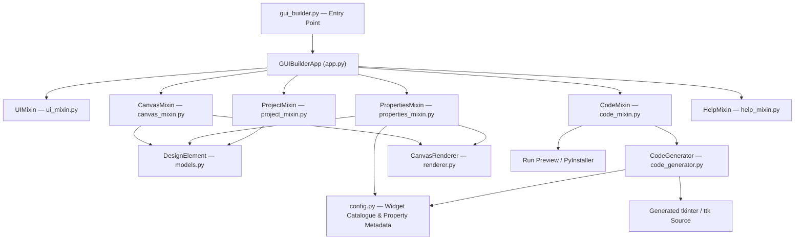

# 🧰 GuiBuilder — Tkinter Visual GUI Designer

> **Drag it. Drop it. Ship it.** A visual, drag-and-drop GUI builder for Python/Tkinter that turns "I need a desktop app" into a finished, runnable `.py` file — without you personally negotiating with `.grid()`, `.pack()`, and `.place()` at 1 a.m.

[](https://www.python.org/)
[](https://docs.python.org/3/library/tkinter.html)
[](#prerequisites-and-system-requirements)
[](#architecture)
[](#preview-and-exe-packaging)
[](#project-status)
[](#contributing)
[](#license)

---

## What is this thing?

**GuiBuilder** is a desktop visual development environment for building real Python desktop applications with **Tkinter** and **ttk** — the GUI toolkit that ships with Python itself, no exotic dependencies required to *run* your finished app.

Instead of starting from a blank `.py` file and immediately arguing with yourself about whether `grid()` should happen before or after the third callback, you **design the interface visually**: drag widgets onto a canvas, tweak their properties in a live inspector, and watch GuiBuilder write clean, readable Python source code for you in real time. When you're happy, hit **Run Preview** to see it live, or **Convert To EXE** to hand your grandmother a double-clickable Windows application.

The best part? You are never locked into a proprietary format. Every design compiles down to plain, editable, "a human wrote this" Python — because the moment a code generator starts hiding logic from you in a `.dll` somewhere, it stops being a tool and starts being a hostage situation.

### The elevator pitch

```
Design visually → Configure properties → Generate Python → Preview live → Edit code freely → Build an .exe
```

GuiBuilder targets developers, engineers, and hobbyists who want a **faster path to a working desktop UI** while keeping full ownership of the generated source — rather than being trapped inside a `.builderfile` that only one piece of software on Earth can open.

### Why it exists (the honest version)

Tkinter is fantastic, fast, and ships free with every Python install. It is also mildly hostile to actually *laying things out*, especially once your form grows past six widgets and you start doing geometry math in your head like it's 1997. GuiBuilder handles the tedious, error-prone plumbing — positioning, sizing, styling, event wiring, packaging — so you can spend your time on the part that actually matters: what your application *does*.

---

## 📸 See it in action

**The designer itself** — toolbox on the left, live canvas in the middle, property inspector on the right:


**A real application generated by GuiBuilder**, running as a standalone window — this is a production form-automation tool built entirely by dragging, dropping, and configuring properties:


No Photoshop. No mockup tool. That second screenshot is a `.py` file GuiBuilder wrote.

---

## Table of Contents

- [What is this thing?](#what-is-this-thing)
- [See it in action](#-see-it-in-action)
- [Features](#-features)
  - [1. The Visual Design Canvas](#1-the-visual-design-canvas)
  - [2. The Widget Toolbox (28 elements)](#2-the-widget-toolbox-28-elements)
  - [3. Instrumentation & Control-Panel Widgets](#3-instrumentation--control-panel-widgets)
  - [4. Containers & Layout Hierarchy](#4-containers--layout-hierarchy)
  - [5. Selection, Grouping & Movement](#5-selection-grouping--movement)
  - [6. The Property Inspector](#6-the-property-inspector)
  - [7. Code Generation](#7-code-generation)
  - [8. The Live Code Editor](#8-the-live-code-editor)
  - [9. Undo / Redo & Persistence](#9-undo--redo--persistence)
  - [10. Preview and EXE Packaging](#10-preview-and-exe-packaging)
  - [11. Images, Tables & Calendars](#11-images-tables--calendars)
- [Architecture](#architecture)
- [Prerequisites and System Requirements](#prerequisites-and-system-requirements)
- [Installation](#installation)
- [Usage](#usage)
  - [Running the Application](#running-the-application)
  - [Basic Workflow](#basic-workflow)
  - [Worked Example: A Login Form](#worked-example-a-login-form)
  - [What Generated Code Looks Like](#what-generated-code-looks-like)
- [Keyboard Shortcuts](#keyboard-shortcuts)
- [Configuration Options](#configuration-options)
- [Key Functions](#key-functions)
- [Sample Projects](#sample-projects)
- [Contributing](#contributing)
- [Troubleshooting](#troubleshooting)
- [Roadmap](#roadmap)
- [License](#license)
- [Support & Contact](#support--contact)
- [Credits & Technology Stack](#credits--technology-stack)

---

## ✨ Features

At a glance:

| Area | What it gives you |
|---|---|
| Visual Designer | Place, select, move, resize, and configure GUI elements on a live canvas |
| Widget Toolbox | 28 elements across Input, Instrumentation, Containers, and Display categories |
| Hierarchical Layout | Nest widgets inside Frames, LabelFrames, PanedWindows, and Notebook tabs |
| Property Inspector | Live editing of text, fonts, colors, geometry, values, and widget-specific options |
| Scoped Selection | `Ctrl+A` for everything, `Ctrl+Shift+A` for "everything in *this* container" |
| Grouping | Assign elements a Group ID so they move together without becoming a hidden Frame |
| Undo / Redo | Full project-state history, debounced so you don't get 40 undo steps from one drag |
| Code Generation | Converts your design into plain, readable `tkinter` / `ttk` source — no hidden runtime |
| Live Code Sync | Generated code updates as you design, while your custom edits are preserved |
| Syntax Checking | AST-based validation in the built-in code editor, before you save something broken |
| Run Preview | Executes the generated app in an isolated process, with dependency auto-detection |
| EXE Packaging | One-click Windows executable via PyInstaller, including missing-package installs |
| Instrumentation Widgets | LEDs, gauges, mechanical push buttons — dashboard-style controls, batteries included |
| Resource Management | Images get copied into a project-relative `resources/` folder — no more "works on my machine" |
| In-App Help | A built-in help panel and hover tooltips for context, so you're never flying blind |

Now, the detailed tour.

### 1. The Visual Design Canvas

The canvas is a grid-snapped surface where your application literally takes shape:

- Click a toolbox tool, click the canvas, and an element appears at that spot.
- Click-drag to reposition; drag the corner/edge handles to resize.
- A small red **✕** appears near each selected element for one-click deletion — the closest thing to a "make it disappear" button that doesn't involve `rm -rf`.
- The canvas redraws automatically after every state change, so what you see is always what you'd get.
- Elements marked *not visible* (see [Property Inspector](#6-the-property-inspector)) are still shown on the design canvas with a dashed outline and a **HIDDEN** badge — because a widget vanishing from the *design surface itself* would make it un-editable, which defeats the purpose of a visual editor.

### 2. The Widget Toolbox (28 elements)

Every element you place maps directly to a real Tkinter/ttk widget class (or a small custom widget for the instrumentation set below) — there is no proprietary intermediate widget system to reverse-engineer later.

| Category | Element | Runtime Class |
|---|---|---|
| Input | 🏷️ Label | `tk.Label` |
| Input | ✍️ Entry | `tk.Entry` |
| Input | 🔘 Button | `tk.Button` |
| Input | ◉ Radiobutton | `tk.Radiobutton` |
| Input | ☑ Checkbutton | `tk.Checkbutton` |
| Input | 🎚️ Scale (Slider) | `tk.Scale` |
| Input | 🔽 Combobox | `ttk.Combobox` |
| Input | 🔢 Spinbox | `tk.Spinbox` |
| Input | 📋 Listbox | `tk.Listbox` |
| Input | 📝 Text (Multiline) | `tk.Text` |
| Input | ⏳ Progressbar | `ttk.Progressbar` |
| Display | 🎨 Canvas (Drawing) | `tk.Canvas` |
| Display | ↕️ Scrollbar | `tk.Scrollbar` |
| Display | ➖ Separator | `ttk.Separator` |
| Display | 📊 Table (Excel/CSV) | `ttk.Treeview` |
| Display | 🖼️ Image | `tk.Label` |
| Display | 📅 Calendar | `Calendar` (`tkcalendar`) |
| Containers | 🖼️ Frame | `tk.Frame` |
| Containers | 🗂️ LabelFrame | `tk.LabelFrame` |
| Containers | 📑 Notebook (Tabs) | `ttk.Notebook` |
| Containers | 🪟 PanedWindow | `tk.PanedWindow` |
| Instrumentation | 🔘 Push Button | `BuilderPushButton` |
| Instrumentation | ◉ Radio Option | `BuilderRadioButton` |
| Instrumentation | 🔢 LED Digit | `BuilderLEDDisplay` |
| Instrumentation | 🔢 LED Display | `BuilderLEDDisplay` |
| Instrumentation | 💡 LED Indicator | `BuilderLEDIndicator` |
| Instrumentation | ⏱️ Gauge / Meter | `BuilderGauge` |
| Instrumentation | 📟 Measurement Display | `BuilderMeasurementDisplay` |

The entire catalogue lives in one place — `gui_builder/config.py`'s `ELEMENT_TYPES` dictionary — so adding a 29th widget type is a controlled configuration-plus-rendering exercise, not a scavenger hunt through a single 5,000-line file.

### 3. Instrumentation & Control-Panel Widgets

Beyond standard form controls, GuiBuilder ships a family of dashboard-style widgets aimed at lab equipment, machine control panels, and test-bench UIs — because not every application in the world is a login form:

| Widget | Purpose | Key Properties |
|---|---|---|
| **Push Button** | Mechanical/control-panel style button | Text, Shape, Style, Behavior (Momentary/Toggle), Default State, colors, Command |
| **Radio Option** | Custom-styled grouped selector | Text, Variable, Value, Shape, Selected state, colors |
| **LED Digit** | A single glowing seven-segment digit | Digit Value, LED Color, Off-Segment Color, Brightness, Glow, Segment Width |
| **LED Display** | Multi-digit seven-segment readout | Value, Digit Count, Leading Zeros, colors, Digit Gap, Brightness, Glow |
| **LED Indicator** | Boolean status lamp | State, On/Off Color, Shape, Brightness, Glow, Source Widget, Source Mode |
| **Gauge / Meter** | Analog-style radial meter | Value, Min/Max, sweep angles, needle/arc/track/tick colors, unit label |
| **Measurement Display** | Value + unit readout | Label, Value, Unit, Modern/LED style, decimal places, prefix/suffix, secondary text |

**The genuinely clever part:** an **LED Indicator** can optionally *bind* to another control — a Push Button, Radio Option, Checkbutton, or Button — via its **Source Widget** property, so the lamp lights up automatically based on that control's state. Three source modes are supported:

- **Mirror** — the LED follows the source widget's current state exactly.
- **Toggle** — the LED flips each time the source is activated.
- **Momentary** — the LED is lit only while the source is actively being interacted with.

This binding is stored by the source element's *stable ID*, not its visible caption — so renaming a button's label doesn't quietly break your indicator lamp three weeks later.

**Runtime independence:** the instrumentation widget code (`gui_builder/instrumentation_widgets.py`) is embedded directly into the generated application when needed. Your exported app never has to `import gui_builder` just to render a blinking LED — it's fully self-contained.

### 4. Containers & Layout Hierarchy

Real applications are nested, and GuiBuilder treats container-aware design as a first-class citizen, not an afterthought:

- **Frame**, **LabelFrame**, **PanedWindow**, and **Notebook** can all own child elements.
- Drop a Button inside a Frame, then drag the Frame — the Button comes along for the ride.
- **Notebook** tabs act as their own design scopes: add tabs, remove tabs, pick the active tab, and place different children inside each one.
- Parent relationships are stored in the model itself, so save/load, undo/redo, and code generation all reconstruct the exact same widget tree every time.

### 5. Selection, Grouping & Movement

- **Single-click** selects one element; modifier-click extends the selection.
- **`Ctrl+A`** selects everything at the root level (classic, global).
- **`Ctrl+Shift+A`** selects everything *inside the current container context* — so nesting a Frame inside your design no longer means "select all" accidentally drags your carefully arranged sub-panel into a selection free-for-all with the rest of the app.
- **Right-click-drag** draws a marquee selection box, scoped to whichever container you're currently working inside.
- **Grouping** (via the right-click context menu) assigns a stable Group ID to a set of elements so they can be selected and moved together — without silently wrapping them in a hidden runtime Frame that shows up as a mystery indent in your generated code.
- Text-entry widgets (and the code editor) keep their **native** `Ctrl+A` / copy / paste behavior — the scoped-selection shortcut never hijacks your ability to select all the text in an Entry box.

### 6. The Property Inspector

The right-hand panel is where a placed element becomes *your* element. Depending on the widget type, you can live-edit:

- Text content, fonts, foreground/background colors, alignment/justification
- Width, height, and other geometry values (kept in sync with on-canvas dragging)
- Widget-specific settings — orientation, numeric ranges (Scale/Spinbox), Combobox/Listbox state
- **Item collections** for Listbox and Combobox via a dedicated add/remove/reorder editor, instead of hand-editing a Python list that's pretending to be a UI (`['Item 1', 'Item 2', 'Item 3']` — never again)
- Notebook tab names and the active tab
- Image source path and aspect-ratio behavior
- Calendar date range, first weekday, and formatting
- Tooltip text and design-time **Visible** flag
- Parent/container assignment

Multi-selecting several elements shows a **shared property panel** so you can, say, set the same font on ten Labels at once instead of clicking each one individually like it's 2003.

### 7. Code Generation

`CodeGenerator.generate()` walks your design model — containers first, then children by depth — and emits a complete, working `MainApplication` class using **plain `tkinter` / `ttk`**. No CustomTkinter, no framework lock-in, no mystery imports your exported app doesn't actually need.

What it handles automatically:

- Import management (only pulling in `pandas`, `PIL`, `tkcalendar`, etc. when an element actually needs them)
- Widget construction and parent-hierarchy reconstruction
- Geometry placement (`.place()` with exact coordinates)
- `tk.StringVar` / `tk.IntVar` creation for Radiobuttons, Checkbuttons, and bound Entry fields
- Notebook tab creation, Listbox item insertion, Combobox values, Spinbox defaults
- Event binding, using a sensible default event per widget type (`command` for buttons, `<KeyRelease>` for text entry, `<<ComboboxSelected>>` for dropdowns, and so on)
- Auto-generated (but fully editable) event-handler method stubs, one per interactive element
- Embedding the tooltip helper and/or instrumentation-widget runtime only when actually used
- Preserving **your** hand-written module-level code and class-level code across regenerations

### 8. The Live Code Editor

Double-click any element (or use the toolbar) to open the integrated code editor:

- View and edit the **full generated source**, or just a single element's event handler
- **Find & Replace** with match highlighting, `F3` / `Shift+F3` to step through matches
- **AST-based syntax checking** — GuiBuilder actually parses your edits with Python's `ast` module and reports the exact line/column of a syntax error before letting a broken save propagate downstream
- One click to **open the generated file in VS Code**
- The editor window is single-instance: reopening it brings the existing window to the front instead of spawning a second one to get confused about

### 9. Undo / Redo & Persistence

- Every meaningful design change pushes a serialized project-state snapshot onto an undo stack (debounced during rapid edits like dragging, so you don't burn through 40 undo steps for one continuous motion).
- `Ctrl+Z` / `Ctrl+Y` (or `Ctrl+Shift+Z`) walk backward and forward through history.
- Designs save as `.tvd` project files — plain JSON under the hood — capturing every element, its properties, the window title, canvas size/background, custom code regions, and the full generated source.
- Reopening a `.tvd` file reconstructs the model, the canvas, the property state, *and* the generated code exactly as you left it.

### 10. Preview and EXE Packaging

**Run Preview** stages your generated app in a temporary directory, checks for any missing third-party packages your design actually requires (auto-detected from what it imports), offers to `pip install` them on the spot, and then runs the app in an isolated subprocess so a bug in your generated app can't take the designer down with it.

**Convert To EXE** wraps the same generated source with **PyInstaller**, streaming the build log back into the builder in real time, and copies the finished executable to wherever you point it. Because pandas' Excel engine and `tkcalendar`'s locale data are loaded dynamically (not via a static top-level import PyInstaller's analysis can see), GuiBuilder knows to pass the right `--collect-all` flags automatically instead of leaving you to discover that the hard way after a 90-second build.

> **Heads-up:** EXE generation targets Windows executables. You can design and preview on macOS/Linux just fine — building the final `.exe` is a Windows-side step.

### 11. Images, Tables & Calendars

- **Image** elements copy your chosen file into the project's `resources/` folder and store a path relative to the project root — anchored to the project location rather than `os.getcwd()`, because Tkinter's native file picker is notorious for silently changing the current working directory as a side effect of just... browsing for a file. (Ask us how we know.)
- **Table** elements are built on `ttk.Treeview` with configuration for external Excel/CSV sources, backed by `pandas` and `openpyxl`.
- **Calendar** elements integrate `tkcalendar`, with configurable date range, first weekday, and display format.

---

## Architecture

GuiBuilder is built as a **composition-root-plus-mixins** design. There's still exactly one `GUIBuilderApp` object from the outside, but its responsibilities are split across focused modules instead of living in one increasingly unmanageable file:



| Module | Responsibility |
|---|---|
| `app.py` | Composition root — wires up state and every mixin, binds global shortcuts |
| `ui_mixin.py` | Application shell: toolbar, toolbox, zoom, scrolling, tooltips |
| `canvas_mixin.py` | Selection, hit-testing, drag/resize, hierarchy, copy/paste, context menus |
| `properties_mixin.py` | The property inspector and live property → model → canvas → code sync |
| `project_mixin.py` | Save/load, undo/redo, new/open/save workflows |
| `code_mixin.py` | Generated-code lifecycle, code editor, syntax checking, preview, EXE build |
| `code_generator.py` | Pure design-model → Python-source conversion, nothing else |
| `renderer.py` | Draws design elements on the canvas — knows nothing about persistence or code |
| `models.py` | The `DesignElement` domain object and its serialization |
| `config.py` | Widget catalogue, property field metadata, defaults, event mapping, constants |
| `dependencies.py` | Centralized imports and optional-dependency detection (e.g., Pillow) |
| `instrumentation_widgets.py` | The self-contained runtime for LEDs, gauges, and mechanical buttons |
| `help_mixin.py` | The in-app help panel and contextual tooltip system |

**Why the split matters:** before adding logic anywhere, the natural question is *"which responsibility does this belong to?"* If the answer is "canvas interaction," it goes in `canvas_mixin.py`. If it's "code generation," it belongs in `code_generator.py`. If the honest answer is "kind of everywhere," that's usually a sign to stop and reconsider — that's precisely how a tidy module becomes an ancient, unmaintainable ruin nobody wants to touch.

This is intentionally pragmatic rather than academic. It is not a microservices architecture for a button editor — that would be a little ambitious for a desktop GUI designer whose scariest dependency is usually a misplaced `.grid()` call.

---

## Prerequisites and System Requirements

| Requirement | Details |
|---|---|
| **Python** | 3.10 or newer |
| **Tkinter** | Included with most standard Python installs; verified separately below |
| **OS** | Windows, macOS, or Linux for designing/previewing |
| **EXE packaging** | Windows only (PyInstaller builds a native `.exe`) |
| **Disk/RAM** | Trivial — this is a desktop form designer, not a neural network |

### Python dependencies

From `requirements.txt`:

```text
Pillow
pandas
openpyxl
tkcalendar
```

`PyInstaller` is used specifically by the **Convert To EXE** workflow. It isn't in `requirements.txt` because not everyone needs to package an executable — install it only if/when you do (GuiBuilder will also offer to install it for you automatically the first time you use that feature).

---

## Installation

### Step 1 — Clone the repository

```bash
git clone https://github.com/rahilkasimi/GuiBuilder.git
cd GuiBuilder
```

### Step 2 — Create a virtual environment (recommended)

**Windows:**
```powershell
python -m venv .venv
.venv\Scripts\activate
```

**macOS / Linux:**
```bash
python3 -m venv .venv
source .venv/bin/activate
```

### Step 3 — Install dependencies

```bash
python -m pip install --upgrade pip
pip install -r requirements.txt
```

Planning to build a Windows executable eventually? Grab PyInstaller too:

```bash
pip install pyinstaller
```

### Step 4 — Verify Tkinter is available

```bash
python -c "import tkinter; print(tkinter.TkVersion)"
```

If this errors out, the problem is your Python/Tk installation, not GuiBuilder — see [Troubleshooting](#troubleshooting).

### Step 5 — Launch GuiBuilder

```bash
python gui_builder.py
```

The main window opens maximized, ready for you to start dragging widgets onto the canvas.

---

## Usage

### Running the Application

The entry point is intentionally tiny — its whole job is to create the Tk root window, construct `GUIBuilderApp`, and start the event loop:

```python
import tkinter as tk
from gui_builder.app import GUIBuilderApp

root = tk.Tk()
GUIBuilderApp(root)
root.mainloop()
```

### Basic Workflow

```text
1.  Launch GuiBuilder
        ↓
2.  Pick a widget from the toolbox
        ↓
3.  Click the canvas to place it
        ↓
4.  Select it and edit its properties
        ↓
5.  Resize / move / nest it inside a container
        ↓
6.  Save the design as a .tvd file        (Ctrl+S)
        ↓
7.  Inspect the auto-generated Python code
        ↓
8.  Run Preview to see the real app run
        ↓
9.  Tweak generated / handler code as needed
        ↓
10. Convert To EXE when you're ready to ship
```

### Worked Example: A Login Form

1. Drag a **Label** onto the canvas; set its text to `Username`.
2. Drag an **Entry** below it.
3. Add another **Label** (`Password`) and a second **Entry** — set its `show` property to `*` to mask input.
4. Add a **Button**, set its text to `Log In`.
5. Select all four and drop them into a **Frame** for tidy grouping.
6. Use the Property Inspector to fine-tune fonts, colors, and sizing.
7. Double-click the button to open its handler in the code editor and write your actual authentication logic.
8. Hit **Run Preview** — a real window pops up, running your real code.
9. Save the design, then **Convert To EXE** once you're happy.

The designer handles the repetitive plumbing so you can focus on what the app actually *does*. Buttons can be dragged around a canvas all day; business logic generally should not be.

### What Generated Code Looks Like

A design with a Label, an Entry, and a Button produces something close to this (trimmed for readability):

```python
"""Generated by Tkinter Visual Designer."""

import tkinter as tk
from tkinter import ttk


class MainApplication:
    def __init__(self, root):
        self.root = root
        root.title("My Application")
        root.geometry("800x600")
        root.configure(bg="#FFFFFF")

        self._elem_1 = tk.Label(root, text="Username", font=("Segoe UI", 9))
        self._elem_1.place(x=40, y=40, width=120, height=30)

        self._elem_2 = tk.Entry(root, font=("Segoe UI", 9))
        self._elem_2.place(x=40, y=80, width=160, height=30)

        self._elem_3 = tk.Button(root, text="Log In", command=self._on_Button_3)
        self._elem_3.place(x=40, y=130, width=100, height=34)

    def _on_Button_3(self, event=None):
        """
        Event handler for Button (ID: 3).
        Triggered by: command
        Access widget instance via: self._elem_3
        """
        pass


if __name__ == '__main__':
    root = tk.Tk()
    app = MainApplication(root)
    root.mainloop()
```

Notice what's *not* there: no custom base classes, no runtime dependency on GuiBuilder itself, no obfuscation. It's a `.py` file a colleague could open cold and immediately understand — because that colleague might be you, six months from now, wondering why `Entry` #17 does what it does.

---

## Keyboard Shortcuts

| Shortcut | Action |
|---|---|
| `Ctrl+N` | New design |
| `Ctrl+O` | Open / load a design |
| `Ctrl+S` | Save design |
| `Ctrl+Shift+S` | Save design as… |
| `Ctrl+Z` | Undo |
| `Ctrl+Y` / `Ctrl+Shift+Z` | Redo |
| `Ctrl+C` / `Ctrl+V` | Copy / paste selected elements |
| `Delete` | Delete selected elements |
| `Arrow keys` | Nudge selected elements |
| `Ctrl+A` | Select all (root level) |
| `Ctrl+Shift+A` | Select all *within the current container* |
| Right-click + drag | Marquee selection (scoped to current container) |
| `Ctrl` + Mouse wheel | Zoom the canvas in/out |
| Double-click an element | Open its code / handler in the code editor |
| Right-click an element | Context menu (group, ungroup, bring to front, send to back, etc.) |

**Inside the code editor:**

| Shortcut | Action |
|---|---|
| `Ctrl+S` | Save code (runs the syntax checker first) |
| `Ctrl+F` | Find |
| `Ctrl+H` | Find & Replace |
| `F3` / `Shift+F3` | Jump to next / previous match |
| `Escape` | Clear search highlighting / close panel |

---

## Configuration Options

GuiBuilder doesn't use an external `config.ini` or `.env` file — it's a design tool, so its "configuration" is the rich, per-widget **property system** you interact with directly in the Property Inspector. Every element type has its own curated field list defined in `PROPERTY_FIELDS` (in `gui_builder/config.py`), so the inspector only ever shows options that are actually relevant to what you've selected.

A few representative examples:

<details>
<summary><strong>Button</strong> — click to expand</summary>

| Field | Description |
|---|---|
| `text` | Button label |
| `font` | Font family / size / weight |
| `fg` / `bg` | Text and background color |
| `command` | Name of the handler method called on click |
| `border_width` | Border thickness |

</details>

<details>
<summary><strong>Combobox</strong> — click to expand</summary>

| Field | Description |
|---|---|
| `values` | The dropdown's item list (edited via the dedicated item editor) |
| `state` | `normal`, `readonly`, or `disabled` |
| `default_value` | Value shown when the app starts |
| `sorted` | Whether items are alphabetized |
| `maxdropdown` / `maxlength` | Visible row cap / input character cap |

</details>

<details>
<summary><strong>Gauge / Meter</strong> — click to expand</summary>

| Field | Description |
|---|---|
| `value`, `min_value`, `max_value` | Current reading and range |
| `start_angle` / `end_angle` | Sweep geometry of the dial |
| `needle_color`, `arc_color`, `track_color`, `tick_color` | Full color control |
| `ticks` | Number of tick marks |
| `unit` | Text label shown next to the value |

</details>

<details>
<summary><strong>Calendar</strong> — click to expand</summary>

| Field | Description |
|---|---|
| `initial_date` | Date shown on load (`YYYY-MM-DD`) |
| `date_pattern` | Display format (`yyyy-mm-dd`, `mm/dd/yyyy`, etc.) |
| `firstweekday` | `monday` or `sunday` |
| `mindate` / `maxdate` | Selectable date range |
| `selectbackground` / `normalbackground` | Selected vs. normal day coloring |

</details>

Two settings apply to **every** element regardless of type, tucked at the end of every property list:

- **Tooltip** — hover text shown in the generated application
- **Visible** — whether the widget is shown when the exported app *starts* (it's still created either way, so any code referencing it continues to work — it just isn't `place()`d until you decide it should be)

Want to extend or tweak defaults globally? `ELEMENT_TYPES["<Type>"]["defaults"]` in `config.py` is the single source of truth every new element of that type is initialized from.

---

## Key Functions

For anyone diving into the codebase, here are the functions doing the heavy lifting, grouped by module:

| Function | Module | What it does |
|---|---|---|
| `GUIBuilderApp.__init__` | `app.py` | Boots the whole application: window, state, bindings, initial UI build |
| `CanvasMixin._add_element` | `canvas_mixin.py` | Places a new `DesignElement` on the canvas at a given position |
| `CanvasMixin._select_all_scoped` | `canvas_mixin.py` | Implements container-aware `Ctrl+Shift+A` selection |
| `CanvasMixin._on_canvas_drag` | `canvas_mixin.py` | Handles live dragging/resizing, including nested-container cascading |
| `CanvasMixin._group_elements` / `_ungroup_elements` | `canvas_mixin.py` | Assigns/clears a design-time Group ID across a selection |
| `PropertiesMixin._show_properties` | `properties_mixin.py` | Builds the live property panel for the selected element(s) |
| `PropertiesMixin._on_live_prop_change` | `properties_mixin.py` | Applies a property edit to the model, canvas, and generated code together |
| `PropertiesMixin._build_item_collection_editor` | `properties_mixin.py` | Powers the Listbox/Combobox item add/remove/reorder UI |
| `ProjectMixin._save_state` / `_load_state` | `project_mixin.py` | Serializes/restores full project snapshots for undo/redo |
| `ProjectMixin._undo` / `_redo` | `project_mixin.py` | Steps through the undo/redo history stacks |
| `ProjectMixin._save_design` / `_load_design` | `project_mixin.py` | Persists/reads `.tvd` project files |
| `CodeGenerator.generate` | `code_generator.py` | Converts the full design model into a complete Python source file |
| `CodeGenerator.generate_element_lines` | `code_generator.py` | Produces the widget-construction + placement lines for one element |
| `CodeMixin._run_preview` | `code_mixin.py` | Stages, dependency-checks, and executes the generated app in a subprocess |
| `CodeMixin._convert_to_exe` | `code_mixin.py` | Drives the PyInstaller build and streams the log back to the UI |
| `CodeMixin._detect_required_packages` | `code_mixin.py` | Infers which third-party packages the generated code actually needs |
| `CodeMixin._check_syntax` | `code_mixin.py` | Runs the code editor's AST-based syntax validation |
| `CodeMixin._extract_custom_regions` | `code_mixin.py` | Pulls out hand-written code so regeneration never silently deletes it |
| `CanvasRenderer.draw_element` | `renderer.py` | Dispatches to the correct per-widget-type drawing routine on the canvas |
| `DesignElement.to_dict` / `from_dict` | `models.py` | Serializes/deserializes a single element for save/load and undo/redo |

---

## Sample Projects

The repository ships with ready-to-open examples so you can explore instead of starting from a blank canvas:

- **`Sample Applications/Calculator_windows.tvd`** — a working calculator UI, demonstrating grid-aligned button layouts and styled controls.
- **`Sample Applications/Instrumentation_Dashboard.tvd`** — a dashboard built entirely from the LED/Gauge/Push-Button instrumentation widgets.
- **`Sample Images/`** — reference screenshots of the designer and a generated application in action (the same ones featured near the top of this README).

Open either `.tvd` file via **Load Design** to see exactly how a finished project is structured.

---

## Contributing

Contributions, bug reports, and "here's a widget you're missing" requests are all welcome.

1. **Fork** the repository and create a feature branch.
2. Keep changes inside their responsibility module — ask yourself *"which mixin/module does this actually belong to?"* before adding it somewhere convenient.
3. Run a quick sanity pass before opening a PR:

```text
[ ] Existing feature behavior still works
[ ] New behavior is documented (README and/or inline comments)
[ ] The change stays within its module's responsibility boundary
[ ] Generated Python source remains syntactically valid
[ ] Save / Load still round-trips correctly
[ ] Undo / Redo still works
[ ] Run Preview still works
[ ] EXE packaging was considered, if relevant
[ ] No unnecessary new dependency was introduced
```

4. Open a Pull Request describing **what** changed and **why** — "fixed stuff" is not a changelog, it's a cry for help.

Found a bug instead? Jump to [Troubleshooting](#troubleshooting) for what to include in a report.

---

## Troubleshooting

| Symptom | Likely Cause | Fix |
|---|---|---|
| `ModuleNotFoundError: No module named 'tkinter'` | Tkinter wasn't installed with your Python distribution (common on some Linux setups) | Debian/Ubuntu: `sudo apt install python3-tk`. Fedora: `sudo dnf install python3-tkinter`. macOS/Windows installers from python.org include it by default. |
| App launches but looks tiny / oddly sized | Multi-monitor DPI scaling quirks | Try adjusting your OS display scaling, or resize the window manually — the designer respects `minsize(1000, 600)` as a floor. |
| Image element shows a placeholder icon instead of my picture | Pillow isn't installed, or the file path is stale | `pip install Pillow`. The design canvas degrades to a placeholder instead of crashing when Pillow is missing — it won't take the whole app down over one thumbnail. |
| Calendar widget option is missing / errors on use | `tkcalendar` not installed | `pip install tkcalendar` (also in `requirements.txt`). |
| **Run Preview** reports a missing package | Your design uses `pandas`, `Pillow`, or `tkcalendar` features not yet installed in this environment | GuiBuilder detects this automatically and offers to `pip install` it for you — accept the prompt, or install manually and retry. |
| **Convert To EXE** fails or hangs | PyInstaller isn't installed, or antivirus is quarantining the build output | `pip install pyinstaller`; temporarily whitelist the build folder if your AV is being overly enthusiastic (PyInstaller EXEs are a classic false-positive target). |
| Excel/CSV Table doesn't load data in the exported EXE | `openpyxl` engine wasn't bundled | GuiBuilder's EXE build automatically detects `pandas` usage and adds the needed `openpyxl` collection — make sure you're on the latest version of this repo. |
| Saved `.tvd` won't open / looks corrupted | Manual hand-editing introduced invalid JSON | `.tvd` files are plain JSON — validate with any JSON linter, or restore from a backup/undo history if available. |
| A property edit doesn't seem to affect the generated code | The property key is design-time only (e.g. it's used purely for on-canvas rendering) | Check `SKIPPED_GENERIC_PROPS` in `config.py` — a small, documented set of properties are intentionally excluded from the generic pass-through because a dedicated code block already handles them. |
| Code editor won't save my edits | AST syntax check caught an actual syntax error | Read the reported line/column — the editor is (politely) refusing to hand broken Python to the next stage of the pipeline. |

### Filing a good bug report

Open a GitHub Issue with:

- Operating system and Python version
- Installed dependency versions (`pip freeze`)
- Exact reproduction steps
- The full error message / traceback
- A minimal `.tvd` project, if the issue is design-specific
- The generated `.py` source, if the issue shows up during Preview or EXE build

A precise bug report is dramatically easier to fix than *"it broke somehow after I clicked the orange thing."*

---

## Roadmap

Ideas, not commitments — contributions toward any of these are very welcome:

- Automated GUI regression tests
- More layout managers and geometry editors beyond absolute positioning
- Expanded `ttk` styling / theming controls
- A formal project-file schema with version migration
- Configurable builder UI themes
- Component templates / reusable design fragments
- Broader cross-platform packaging (macOS `.app`, Linux binaries)

---

## Project Status

GuiBuilder is **actively developed** and built around an SRP-oriented modular architecture with a live code-generation workflow. Recent work has focused on:

- Container-scoped selection and marquee selection
- Listbox / Combobox structured item editing
- Correct border-width handling across Tk vs. ttk widgets
- Spinbox default-value initialization fixes
- The full instrumentation widget family (LEDs, gauges, mechanical buttons) with source-widget bindings
- Design-time grouping and right-click context menus
- A single-instance code editor window with find/replace and syntax checking

The architecture is intentionally set up so new features land in the module that actually owns that responsibility, instead of reopening the "one giant file" problem the project was refactored away from in the first place.

---

## License

**License: TBD.**

No license file currently ships with this repository. Before publishing it publicly (or accepting external contributions), add an explicit `LICENSE` file — MIT and Apache-2.0 are common, developer-friendly defaults for a project like this.

> ⚠️ Don't publish a repository containing third-party code or assets under a license you don't have the rights to grant.

---

## Support & Contact

Questions, bug reports, feature requests, or just want to show off the wildest dashboard you've built with the instrumentation widgets?

📧 **Email:** [rahilkasimi@gmail.com](mailto:rahilkasimi@gmail.com)
🐛 **Bugs / Features:** Open a GitHub Issue on this repository (see [Troubleshooting](#troubleshooting) for what to include)

---

## Credits & Technology Stack

| Technology | Role |
|---|---|
| **Python** | Application language |
| **Tkinter / ttk** | GUI toolkit for both the builder itself and every generated app |
| **Pillow** | Image loading and thumbnail handling |
| **pandas** | Table/Excel/CSV data workflows |
| **openpyxl** | Excel workbook read/write engine |
| **tkcalendar** | The Calendar element |
| **PyInstaller** | Windows executable packaging |

---

### Final word

The design philosophy behind GuiBuilder fits in one sentence:

> **Make GUI layout fast and visual, while keeping the generated Python honest, readable, and entirely yours.**

It isn't trying to replace Python, and it definitely isn't trying to replace *you*. It's trying to remove the repetitive, error-prone parts of building a Tkinter interface so you can spend your time on the logic that actually makes your application useful — and marginally less time deciding whether a button should be 98 or 100 pixels wide.

**Happy building. 🛠️**
